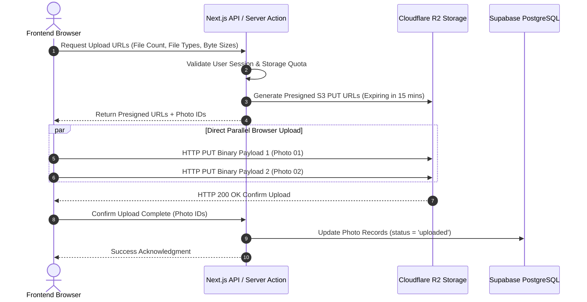
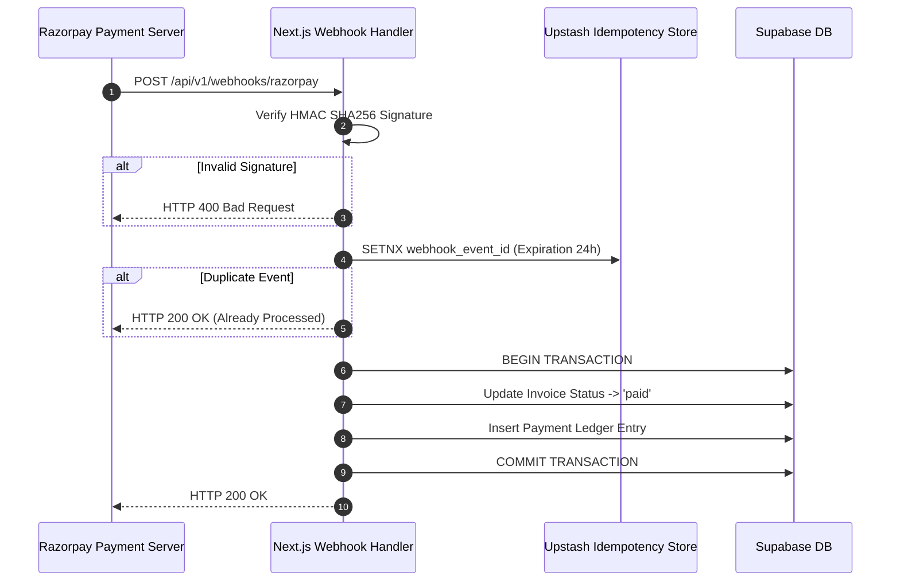

# PhotoMagic Studio OS — API Architecture & Backend Contracts (Phase 0.8)

---

> **Document Status**: Master Backend Contract & API Reference (v1.0)  
> **Role**: Principal Backend Architect  
> **Target Framework**: Next.js App Router (Server Actions & Route Handlers)  
> **Backend Service Layer**: Supabase Managed PostgreSQL + Supabase Auth  
> **Storage API**: Cloudflare R2 S3-Compatible Presigned API  
> **Payment Gateway API**: Razorpay SDK & Webhook Architecture  

---

## 1. API Design Philosophy

PhotoMagic Studio OS uses a **Dual API Architecture Paradigm**:

1. **Internal Application API**: **Next.js Server Actions**. Provides end-to-end, zero-boilerplate TypeScript safety for internal frontend mutations (`apps/client-portal`, `apps/studio-os`).
2. **External & Webhook REST API**: **Next.js Route Handlers (`/api/v1/*`)**. Standardized RESTful JSON endpoints for third-party integrations, mobile clients, and inbound webhooks (Razorpay).

```
+---------------------------------------------------------------------------------------------------+
|                                     DUAL API ARCHITECTURE MODEL                                   |
|                                                                                                   |
|  [ Client Web Apps ] ────── Server Action Call ──────> [ Next.js Server Actions ] ──> [ Supabase DB ]
|                                                                 │
|  [ Third Party / Webhooks ] ── HTTP REST Request ──> [ /api/v1/ Route Handlers ] ──> [ Supabase DB ]
+---------------------------------------------------------------------------------------------------+
```

---

## 2. API Contract Standards

### 2.1 Request Envelope Format
All REST API requests must provide a JSON body adhering to camelCase property conventions.

### 2.2 Standardized Success Response Contract
```typescript
interface APISuccessResponse<T> {
  success: true;
  data: T;
  meta?: {
    page?: number;
    limit?: number;
    totalCount?: number;
    cursor?: string;
    hasMore?: boolean;
  };
  timestamp: string; // ISO 8601 UTC
}
```

### 2.3 Standardized Error Response Contract
```typescript
interface APIErrorResponse {
  success: false;
  error: {
    code: string;           // E.g., 'UNAUTHORIZED', 'INVALID_SELECTION_LIMIT', 'PAYMENT_FAILED'
    message: string;        // Human readable explanation
    details?: Array<{       // Zod validation field breakdown
      field: string;
      message: string;
    }>;
  };
  timestamp: string;
}
```

---

## 3. Upload & Presigned Storage Pipeline

To avoid proxying massive multi-gigabyte photography files through serverless compute functions, media assets are uploaded **directly from the client browser to Cloudflare R2** using S3 presigned URLs.

### 3.1 Presigned Upload Sequence Diagram



---

## 4. Webhook Ingestion & Security Architecture

### 4.1 Razorpay Payment Webhook Contract
- **Endpoint Route**: `/api/v1/webhooks/razorpay`
- **HTTP Method**: `POST`
- **Security Validation**:
  1. Compute HMAC SHA256 signature using `X-Razorpay-Signature` header and raw request buffer.
  2. If signature fails, return `HTTP 400 Bad Request` immediately.
- **Idempotency Strategy**: Store processed webhook `event_id` in `payment_events` table. If duplicate event arrives, respond `HTTP 200 OK` without re-processing financial ledger.



---

## 5. Background Job & Event-Driven Processing

Heavy tasks (zip packaging, AI visual culling, batch email notification dispatch) run asynchronously via background job queues (Inngest / Trigger.dev) to ensure fast 200ms API response times.

### 5.1 Asynchronous Zip Packaging Workflow

```
[ Client Clicks "Download All High-Res" ] ──> [ Server Action: Trigger Zip Job ]
                                                        │
                                                        v
                                          [ Inngest Queue Event: zip.requested ]
                                                        │
                                                        v
                                          [ Worker: Stream R2 Files -> Zip Stream ]
                                                        │
                                                        v
                                          [ Save Archive to R2 /zips/{id}.zip ]
                                                        │
                                                        v
                                          [ Send Realtime Notification + SMS Link ]
```

---

## 6. Cursor-Based Pagination Contract

For high-volume photo galleries (5,000+ items), pagination uses **Cursor-based Keys** rather than slow OFFSET queries.

### 6.1 Request Query Parameters
`GET /api/v1/galleries/{gallery_id}/photos?limit=50&cursor=eyJpZCI6IjEyMyIsImNyZWF0ZWRfYXQiOiIxNjgwMDAwMCJ9`

### 6.2 Cursor Meta Contract
```json
{
  "meta": {
    "limit": 50,
    "hasMore": true,
    "nextCursor": "eyJpZCI6IjQ1NiIsImNyZWF0ZWRfYXQiOiIxNjgwMDYwMCJ9"
  }
}
```

---

## 7. Rate Limiting & Security Blueprint

- **Rate Limiting Provider**: Upstash Redis Sliding Window Algorithm.
- **Rules Matrix**:

| Endpoint Route / Action | Allowed Rate Limit | Window | Action on Exceeded |
|:---|:---|:---|:---|
| **Public Inquiry Form** | 5 Requests | 1 Minute | HTTP 429 Too Many Requests |
| **Auth / Magic Link** | 3 Requests | 15 Minutes | HTTP 429 + Lockout Alert |
| **Presigned URL Request**| 60 Requests | 1 Minute | HTTP 429 |
| **General Admin API** | 300 Requests | 1 Minute | HTTP 429 |

---

## 8. AI Integration API Contracts

### 8.1 Gemini API & Google Vision Integration
- **Function**: AI Smart Culling & Automated Scene Tagging.
- **Workflow**:
  1. Background Worker sends low-res proof URL (`r2_proof_key`) to Gemini 1.5 Flash Vision API.
  2. Gemini extracts facial expressions, lighting quality score (0.00 to 1.00), and auto-tags (`Ceremony`, `Bride`, `Cake Cutting`, `Out of Focus`).
  3. Tags and quality scores are written back to `photos.exif_data` and `photo_embeddings` tables.

---

## 9. API Error Codes Glossary

| Error Code | HTTP Status | Meaning & Cause |
|:---|:---:|:---|
| `UNAUTHORIZED` | 401 | Missing or invalid Supabase JWT authentication session. |
| `FORBIDDEN` | 403 | User role lacks permission for target resource/workspace. |
| `RESOURCE_NOT_FOUND` | 404 | Target entity ID does not exist or has been soft-deleted. |
| `SELECTION_LIMIT_EXCEEDED` | 422 | Client attempted to favor more photos than package allowance. |
| `PAYMENT_SIGNATURE_INVALID` | 400 | Razorpay HMAC signature verification failed. |
| `RATE_LIMIT_EXCEEDED` | 429 | Client exceeded request limits for endpoint window. |

---

## 10. Summary & Next Steps

This **API Architecture & Backend Contracts Blueprint** establishes the binding interface between frontend client applications, background processing engines, and third-party payment/AI services for PhotoMagic Studio OS. All upcoming Next.js Server Actions, Route Handlers, and Webhook implementations must adhere strictly to these response schemas, security rules, and upload sequence flows.
