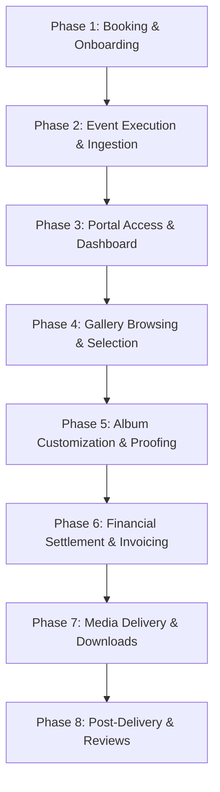
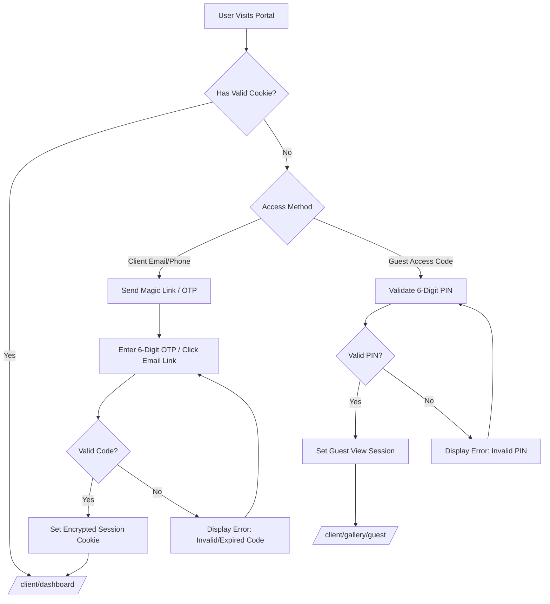
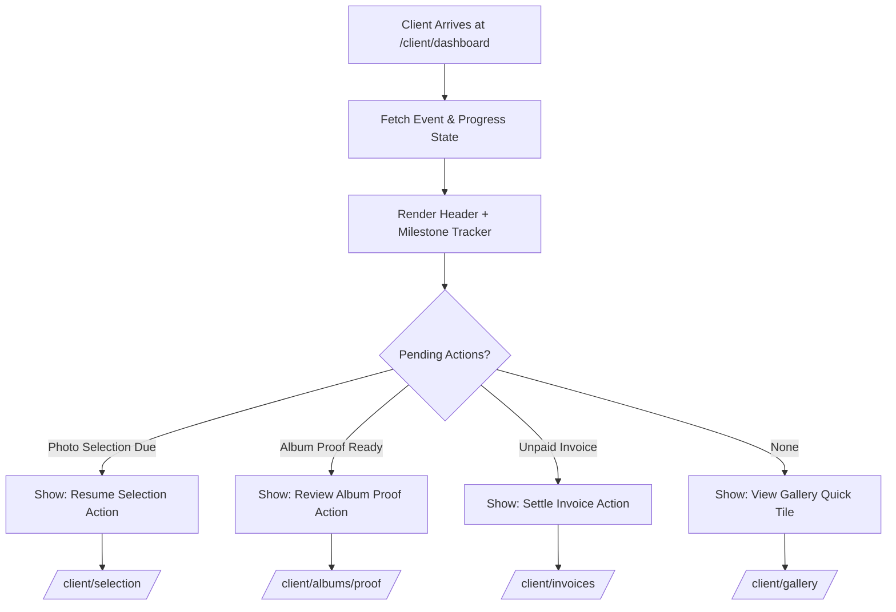
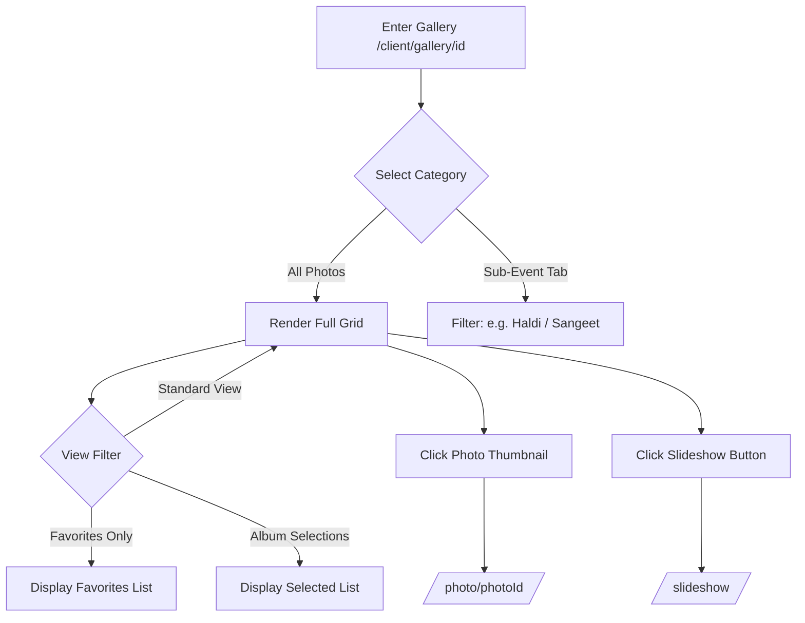
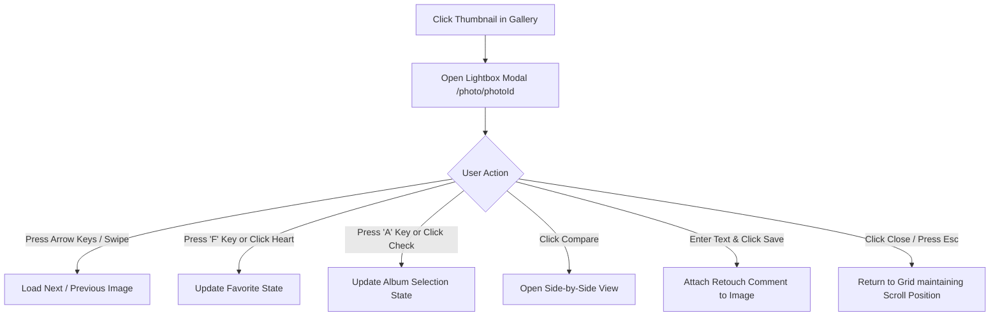
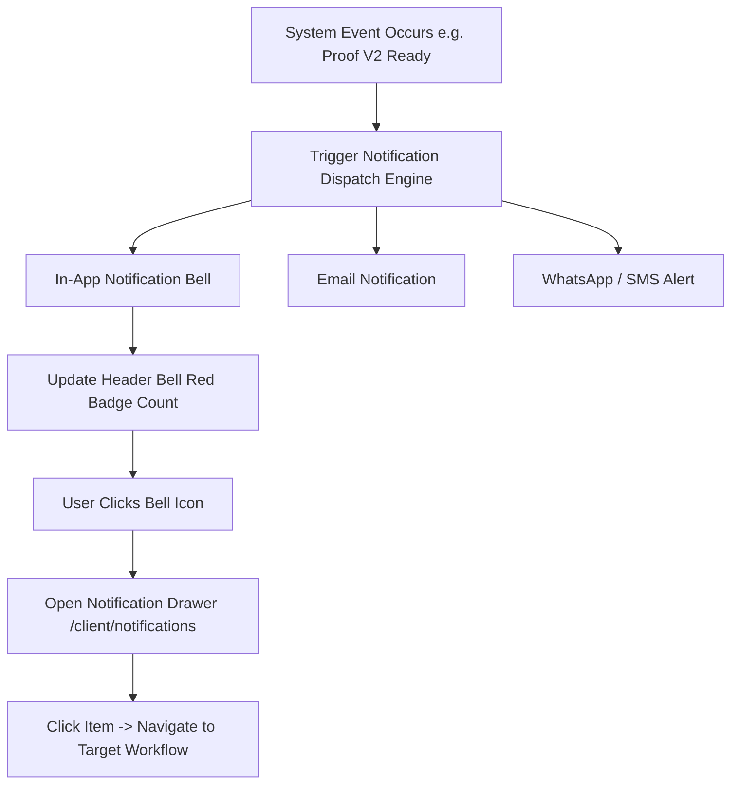
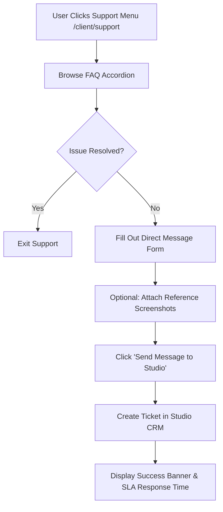

# Phase C1 – Client Journey & Information Architecture
**Studio / Product:** PhotoMagic by RK – Photography Client Portal  
**Document Version:** 1.0.0  
**Status:** Master Information Architecture & User Experience Blueprint  

---

## Executive Summary

This document serves as the master blueprint for the PhotoMagic by RK Client Portal architecture. It establishes the complete end-to-end user experience, sitemap structure, granular screen-by-screen specifications, workflow logic diagrams, and core UX design principles. This blueprint guarantees that all subsequent frontend, backend, and database implementations adhere to a unified, frictionless, luxury client experience.

---

## 1. End-to-End Client Journey

### 1.1 Journey Lifecycle Overview

The client journey spans eight distinct phases from initial event contract signing through post-delivery archiving and referral generation.



### 1.2 Granular Phase Breakdown Matrix

| Phase | Client Mindset & Emotion | Key Touchpoints | System Automated Triggers | Milestone Output |
| :--- | :--- | :--- | :--- | :--- |
| **1. Booking & Onboarding** | Excitement, anticipation | Welcome Email, Portal Magic Link | Client Account auto-created on CRM sync | Access Granted |
| **2. Event Execution** | Celebration, immersion | Studio Photo Shoot, RAW Offloading | Ingest pipeline generates WebP previews | Event Ingest Complete |
| **3. Portal Access** | Curiosity, eagerness | Mobile SMS alert, Access PIN | Gallery status updated to `Published` | First Portal Session |
| **4. Gallery & Selection** | Delight, nostalgia, focus | Gallery Grid, Lightbox, Favorites | Auto-save selection counter, draft locks | Photo Selection Locked |
| **5. Album & Proofing** | Creative involvement | 3D Flipbook, Pinpoint Comments | Revision notification sent to Studio | Album Approved |
| **6. Payments** | Trust, fulfillment | Invoice Portal, Gateway Checkout | Payment receipt, download lock removal | Balance Settled ($0) |
| **7. Media Delivery** | Joy, gratification | High-Res ZIP Downloads | Background ZIP generator, expiry timer | Assets Downloaded |
| **8. Archive & Review** | Gratitude, advocacy | Review prompt, Social Sharing | Cloud cold storage migration after 365 days | Testimonial Received |

---

## 2. Website Navigation Structure

### 2.1 Global Information Architecture Sitemap

```mermaid
graph TD
    Root[/Client Portal Root /]
    
    Root --> Auth[/Auth & Access Module/]
    Auth --> L1[Login Gateway /client/login]
    Auth --> L2[OTP/Magic Link Verification /client/verify]
    Auth --> L3[Guest PIN Entry /client/guest-access]
    
    Root --> Dash[Dashboard Hub /client/dashboard]
    
    Root --> Gal[Gallery Engine /client/gallery/[eventId]]
    Gal --> G1[Category Sub-Galleries]
    Gal --> G2[Filtered Views: Favorites & Selections]
    Gal --> G3[Photo Inspector Lightbox /photo/[photoId]]
    Gal --> G4[Side-by-Side Comparison /compare]
    Gal --> G5[Ambient Slideshow /slideshow]
    
    Root --> Sel[Photo Selection Manager /client/selection]
    Sel --> S1[Retouch Notes Editor /client/selection/notes]
    Sel --> S2[Lock & Submit Modal /client/selection/submit]
    
    Root --> Alb[Album & Proofing Engine /client/albums/[albumId]]
    Alb --> A1[Album Configurator /client/album-customization]
    Alb --> A2[Flipbook Proof Viewer /proof]
    Alb --> A3[Revision Pin Manager /comments]
    Alb --> A4[Digital Sign-Off /approve]
    
    Root --> Pay[Financial Settlement /client/invoices]
    Pay --> P1[Invoice Ledger View]
    Pay --> P2[Gateway Checkout /pay]
    Pay --> P3[Receipt Viewer /receipt]
    
    Root --> Dwn[Media Download Center /client/downloads]
    Dwn --> D1[Batch Sub-Gallery ZIP]
    Dwn --> D2[ZIP Processing Screen]
    
    Root --> Not[Notification Hub /client/notifications]
    Root --> Sup[Support & Help Desk /client/support]
```

---

## 3. Login Flow

### 3.1 Login Workflow Diagram



### 3.2 Screen Specifications: Login Gateway (`/client/login`)
* **Purpose:** Secure entry point providing passwordless authentication for primary clients and guest code access for attendees.
* **User Goals:** Access personal wedding gallery quickly without remembering passwords.
* **Actions Available:** Request Magic Link, enter WhatsApp OTP, submit Guest Access PIN, toggle "Remember Me".
* **Entry Points:** Direct URL bookmark, SMS/Email notification links, studio homepage link.
* **Exit Points:** Dashboard (`/client/dashboard`) upon client auth, Guest Gallery (`/client/gallery/[eventId]`) upon PIN auth.
* **Related Screens:** OTP Verification (`/client/verify`), Guest Access (`/client/guest-access`).

### 3.3 Screen Specifications: OTP Verification (`/client/verify`)
* **Purpose:** Verify 6-digit numeric passcode sent to client's phone or email.
* **User Goals:** Complete multi-factor verification seamlessly.
* **Actions Available:** Input 6-digit OTP, click "Resend Code" (with 60s cooldown timer), switch login method.
* **Entry Points:** Form submission from `/client/login`.
* **Exit Points:** Client Dashboard (`/client/dashboard`) on success; returns to `/client/login` on cancellation.
* **Related Screens:** Login Gateway (`/client/login`).

---

## 4. Dashboard Information Architecture

### 4.1 Dashboard Workflow Diagram



### 4.2 Screen Specifications: Client Dashboard (`/client/dashboard`)
* **Purpose:** Operational center providing real-time status of the photography project, upcoming deadlines, and quick navigation.
* **User Goals:** Understand project status instantly and take immediate action on outstanding tasks.
* **Actions Available:** Click pending action cards, view progress bar details, quick-launch gallery slideshow, jump to invoices/downloads.
* **Entry Points:** Successful authentication, header logo click, direct URL access.
* **Exit Points:** Gallery (`/client/gallery/[eventId]`), Selection Workbench (`/client/selection`), Album Proofing (`/client/albums/[albumId]/proof`), Invoices (`/client/invoices`), Downloads (`/client/downloads`).
* **Related Screens:** Notifications (`/client/notifications`), Support (`/client/support`).

---

## 5. Gallery Navigation

### 5.1 Gallery Navigation Diagram



### 5.2 Screen Specifications: Main Event Gallery (`/client/gallery/[eventId]`)
* **Purpose:** Display thousands of event photographs in an organized, responsive grid layout.
* **User Goals:** Browse photos effortlessly, filter by sub-event, and identify favorite photos.
* **Actions Available:** Switch sub-gallery tabs, change grid density (Masonry/Justified), filter by Favorites/Selections, launch slideshow, quick-heart photo.
* **Entry Points:** Dashboard quick link, direct gallery email link, header navigation.
* **Exit Points:** Lightbox Inspector (`/photo/[photoId]`), Selection Workbench (`/client/selection`), Dashboard (`/client/dashboard`).
* **Related Screens:** Side-by-Side Comparison (`/compare`), Slideshow Player (`/slideshow`).

---

## 6. Photo Viewer Workflow

### 6.1 Lightbox Workflow Diagram



### 6.2 Screen Specifications: Full-Screen Lightbox Inspector (`/photo/[photoId]`)
* **Purpose:** Distraction-free, high-resolution photo viewer for detailed inspection and feedback.
* **User Goals:** Inspect image details, add retouch notes, mark for album inclusion, or compare with similar shots.
* **Actions Available:** Zoom/pan (100% view), toggle EXIF data, favorite, select for album, post comment, open side-by-side view, download single photo (if permitted).
* **Entry Points:** Gallery thumbnail click, direct photo deep-link.
* **Exit Points:** Gallery Grid View (`/client/gallery/[eventId]`), Comparison Screen (`/compare`).
* **Related Screens:** Gallery Grid View, Selection Workbench (`/client/selection`).

---

## 7. Photo Selection Workflow

### 7.1 Photo Selection Diagram

```mermaid
flowchart TD
    StartSel[Open Selection Workbench /client/selection] --> FetchQuota[Load Quota: e.g. 100 Max Photos]
    FetchQuota --> DisplayList[Render Selected Photos Grid]
    
    DisplayList --> CheckCount{Current Count vs Quota}
    CheckCount -- Under Quota --> AllowAdd[Allow adding more from Gallery]
    CheckCount -- Over Quota --> ShowWarning[Display Warning: Remove X photos]
    CheckCount -- Exact Quota --> EnableLock[Enable 'Lock & Submit Selection' Button]
    
    AllowAdd --> OpenNoteEditor[Add/Edit Retouch Notes per Photo]
    ShowWarning --> RemovePhoto[Remove excess photos] --> CheckCount
    
    EnableLock --> ClickSubmit[Click Lock & Submit]
    ClickSubmit --> ConfirmModal{Confirm Locking Selection?}
    ConfirmModal -- Yes --> LockState[Set State: Locked -> Notify Studio] --> NextStep[/client/album-customization]
    ConfirmModal -- No --> DisplayList
```

### 7.2 Screen Specifications: Selection Workbench (`/client/selection`)
* **Purpose:** Dedicated workstation for clients to review, adjust, note, and finalize their photo selections for album printing.
* **User Goals:** Finalize the precise list of photos for the album print within their package quota.
* **Actions Available:** Remove photo from list, add retouch notes (e.g. "skin retouch", "crop background"), prioritize cover photo, submit final locked list.
* **Entry Points:** Dashboard prompt, gallery selection bar, navigation menu.
* **Exit Points:** Gallery Grid (to select more), Album Customization (`/client/album-customization`).
* **Related Screens:** Retouch Notes Editor, Submission Confirmation Modal.

---

## 8. Album Proof Workflow

### 8.1 Album Proofing Diagram

```mermaid
flowchart TD
    ProofNotice[Client Receives Album Draft Ready Alert] --> OpenProof[Open Flipbook Viewer /albums/id/proof]
    OpenProof --> BrowseSpreads[Flip Through Double-Page Spreads]
    
    BrowseSpreads --> Decision{Client Assessment}
    Decision -- Requires Changes --> DropPin[Click Image on Spread -> Drop Feedback Pin]
    Decision -- Looks Perfect --> ClickApprove[Click Approve Album for Printing]
    
    DropPin --> WriteComment[Type Detailed Revision Instructions]
    WriteComment --> SavePin[Save Pin #N] --> HasMorePins{More Revisions?}
    HasMorePins -- Yes --> DropPin
    HasMorePins -- No --> SubmitRev[Click Submit Revisions to Studio]
    
    SubmitRev --> LockRevState[Set Status: Revisions Submitted] --> StudioNotify[Notify Layout Artist]
    ClickApprove --> DigitalSig[Open Digital Signature Modal] --> ConfirmSig[Approve & Sent to Press] --> PayRoute[/client/invoices]
```

### 8.2 Screen Specifications: Flipbook Proof Viewer (`/client/albums/[albumId]/proof`)
* **Purpose:** Virtual double-page spread reviewer enabling precise pin-point feedback for album layout revisions.
* **User Goals:** Review layout design, communicate necessary edits visually, and grant final print approval.
* **Actions Available:** Turn pages, drop revision pins on photos, type revision comments, view past revision history, submit revision batch, approve layout.
* **Entry Points:** Dashboard task card, email/SMS proof notification link.
* **Exit Points:** Invoices (`/client/invoices`) upon final approval, Dashboard (`/client/dashboard`).
* **Related Screens:** Album Configurator (`/client/album-customization`), Digital Sign-Off Modal.

---

## 9. Payment Workflow

### 9.1 Payment Settlement Diagram

```mermaid
flowchart TD
    InvArrival[Open Invoices Page /client/invoices] --> DisplayLedger[Display Contract Balance & Itemized Extras]
    DisplayLedger --> SelectInv[Select Outstanding Invoice]
    SelectInv --> ClickPay[Click 'Pay Securely Now']
    
    ClickPay --> GatewayHandoff[Launch Integrated Gateway: Stripe / Razorpay]
    GatewayHandoff --> ProcessPayment{Payment Status}
    
    ProcessPayment -- Success --> UpdateLedger[Mark Invoice: PAID ($0 Balance)]
    UpdateLedger --> UnlockAssets[Unlock High-Res Media Downloads]
    UnlockAssets --> ShowReceipt[Render Payment Receipt & Download Button] --> DwnRoute[/client/downloads]
    
    ProcessPayment -- Failed --> ShowPayError[Display Payment Error & Retry Prompt] --> SelectInv
```

### 9.2 Screen Specifications: Invoices & Statements Overview (`/client/invoices`)
* **Purpose:** Financial console detailing package costs, extra add-ons, payments made, remaining balance, and online payment actions.
* **User Goals:** Review itemized charges, download PDF statements, and pay balances safely.
* **Actions Available:** Select payment method (Credit Card, Debit Card, UPI, Net Banking), launch gateway checkout, download PDF invoices and receipts.
* **Entry Points:** Post-album approval trigger, dashboard alert link, top navigation.
* **Exit Points:** Download Center (`/client/downloads`) post-payment, Dashboard (`/client/dashboard`).
* **Related Screens:** Payment Checkout Gateway, Receipt Viewer.

---

## 10. Download Workflow

### 10.1 Media Download Diagram

```mermaid
flowchart TD
    DwnHub[Open Download Center /client/downloads] --> CheckPaid{Is Contract Fully Paid?}
    CheckPaid -- No --> ShowLock[Display Payment Lock Warning + Pay Link] --> PayRoute[/client/invoices]
    CheckPaid -- Yes --> ShowOptions[Display Download Options: High-Res vs Web-Res]
    
    ShowOptions --> Choice{Select Download Scope}
    Choice -- Full Event High-Res --> GenFullZIP[Trigger Full High-Res ZIP Generation]
    Choice -- Sub-Gallery ZIP --> GenSubZIP[Trigger Sub-Gallery ZIP Generation]
    Choice -- Single Photo --> DirectDwn[Direct CDN Image Download]
    
    GenFullZIP --> Processing[Show Processing Status: Preparing Archives...]
    Processing --> ZIPReady[ZIP Prepared -> Trigger Direct Download]
    ZIPReady --> Complete[Download Completed & Logged]
```

### 10.2 Screen Specifications: Media Download Center (`/client/downloads`)
* **Purpose:** Centralized hub for acquiring original high-resolution master image archives and web-optimized social media files.
* **User Goals:** Download event photos easily in high quality for print or smaller file sizes for social media.
* **Actions Available:** Trigger full-event ZIP download, download single sub-gallery ZIPs, view download expiration counter, copy guest download links.
* **Entry Points:** Header navigation menu, post-payment confirmation button, email notification link.
* **Exit Points:** External browser download manager, Dashboard (`/client/dashboard`).
* **Related Screens:** Invoices (`/client/invoices`), Main Gallery (`/client/gallery/[eventId]`).

---

## 11. Notification Flow

### 11.1 Notification & Dispatch Workflow Diagram



### 11.2 Screen Specifications: Notification Center Drawer (`/client/notifications`)
* **Purpose:** Centralized real-time hub tracking all studio communications, file uploads, layout proofs, and financial milestones.
* **User Goals:** Stay updated on project developments and respond quickly to studio requests.
* **Actions Available:** Click notification item to navigate to target screen, mark as read, configure notification delivery channels.
* **Entry Points:** Header notification bell icon click.
* **Exit Points:** Target workflow screen associated with notification item.
* **Related Screens:** Notification Preferences (`/client/notifications/settings`).

---

## 12. Support Workflow

### 12.1 Studio Support Diagram



### 12.2 Screen Specifications: Help & Support Center (`/client/support`)
* **Purpose:** Direct communication portal connecting clients with RK and the studio team for assistance or specialized requests.
* **User Goals:** Resolve questions quickly regarding selections, proofs, payments, or custom editing requests.
* **Actions Available:** Search/expand FAQ questions, send direct ticket messages, attach images, access phone/WhatsApp studio contacts.
* **Entry Points:** Header menu, footer support link, help icons embedded across workflow pages.
* **Exit Points:** Dashboard (`/client/dashboard`), Gallery (`/client/gallery/[eventId]`).
* **Related Screens:** Client Dashboard.

---

## 13. Mobile Navigation

### 13.1 Mobile Layout Architecture (`viewports < 768px`)

```
+------------------------------------+
|  [=]  PHOTOMAGIC BY RK     (Bell)  |  <- Sticky Header (56px)
+------------------------------------+
|                                    |
|         MAIN CONTENT AREA          |
|      (Fluid scrollable region)     |
|                                    |
+------------------------------------+
| [🏠 Hub] [🖼️ Gallery] [📖 Proof] [💳 Pay] |  <- Fixed Bottom Nav (60px)
+------------------------------------+
```

### 13.2 Mobile Touch Gestures & Patterns

* **Fixed Bottom Navigation:** High-frequency routes (`Dashboard`, `Gallery`, `Proof`, `Invoices`) pinned to the thumb-friendly bottom bar.
* **Lightbox Gestures:** Swipe left/right for image navigation; swipe down to close; double-tap to zoom.
* **Mobile Drawer Menu:** Secondary links (`Support`, `Downloads`, `Notification Settings`, `Profile`) accessible via top-left hamburger menu (`[=]`).
* **Optimized Touch Targets:** All clickable actions conform to minimum 44x44px hit areas.

---

## 14. Desktop Navigation

### 14.1 Desktop Layout Architecture (`viewports >= 1024px`)

```
+-----------------------------------------------------------------------+
|  PHOTOMAGIC BY RK   [Dashboard] [Gallery] [Selections] [Albums] [Invoices] (Bell) [Profile v] |  <- Sticky Header (64px)
+-----------------------------------------------------------------------+
|                                                                       |
|                         MAIN CONTENT CANVAS                           |
|                                                                       |
+-----------------------------------------------------------------------+
|  Footer: © PhotoMagic by RK • Privacy Policy • Direct Studio Support |
+-----------------------------------------------------------------------+
```

### 14.2 Desktop Ergonomics & Keyboard Map

* **Keyboard Navigation Shortcuts:**
  * `Left Arrow` / `Right Arrow`: Previous / Next photo in Lightbox & Album Proofs.
  * `F`: Toggle Favorite status on current photo.
  * `A`: Toggle Album Selection on current photo.
  * `Esc`: Exit Lightbox, modals, or slide-over drawers.
  * `Spacebar`: Toggle slideshow play/pause.

---

## 15. UX Principles

To guarantee a world-class luxury user experience, all portal components must comply with these six core UX principles:

### Principle 1: Visual Supremacy (Photo-First Canvas)
* The photography must always be the hero. User interface chrome (buttons, bars, backgrounds) should remain subtle, minimalist, and dark-themed so high-resolution photos stand out cleanly without distraction.

### Principle 2: Zero-Friction Access
* Clients must never be locked out by forgotten passwords. Authentication relies on passwordless Magic Links, WhatsApp OTPs, and one-click session resumption cookies.

### Principle 3: Reassuring State Feedback
* Every action (selecting a photo, dropping a revision pin, paying an invoice) must provide immediate visual feedback. Draft selections auto-save continuously, eliminating fear of lost work.

### Principle 4: Luxury Aesthetic Elegance
* Styled with curated HSL color palettes, subtle champagne gold accents, glassmorphic overlays, modern Google typography (Inter / Cormorant Garamond), and 60fps micro-animations.

### Principle 5: Transparent Accountability
* Project milestones, album proof version counts, selection caps, and invoice breakdowns are explicitly displayed with clear deadline badges to ensure smooth collaboration.

### Principle 6: Mobile-First Performance
* Every workflow is optimized for touch devices first, ensuring fast page load speeds (< 1.5s on 4G) via WebP rendering, lazy loading, and intelligent image caching.

---

## Conclusion & Next Steps

This document completes **PHASE C1 – CLIENT JOURNEY & INFORMATION ARCHITECTURE**. It serves as the authoritative blueprint for routing, interaction flows, sitemap architecture, and UX criteria across all subsequent client portal development phases.
