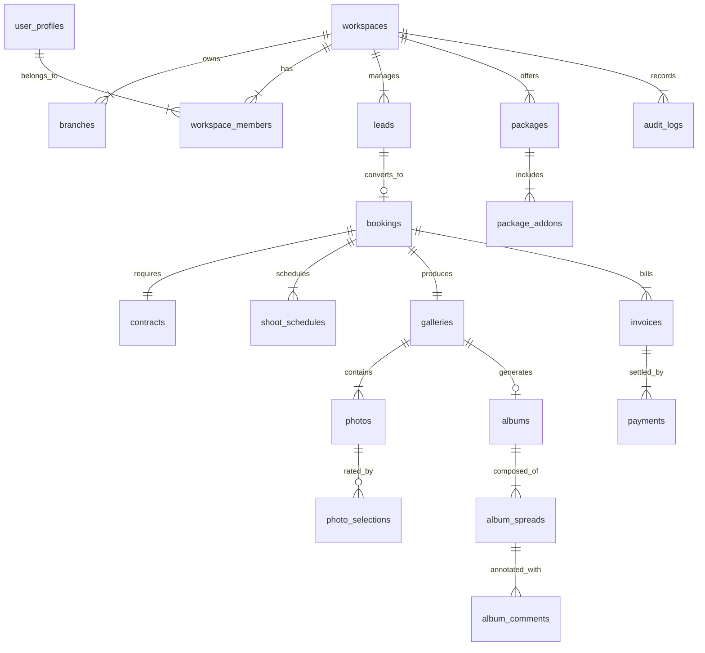

# PhotoMagic Studio OS — Database Architecture & Entity Relationship Design (Phase 0.5)

---

> **Document Status**: Master Database Architecture Reference (v1.0)  
> **Role**: Principal Database Architect  
> **Target Platform**: PostgreSQL 15+ (Supabase)  
> **Tenant Model**: Multi-Workspace & Multi-Branch Tenant Architecture (`workspace_id` + `branch_id`)  
> **Object Storage Interface**: Cloudflare R2 (Metadata Only in DB)  

---

## 1. Domain Boundaries

The database schema is partitioned into 7 logical domain boundaries to ensure high cohesion, low coupling, and clear service ownership.

```
+---------------------------------------------------------------------------------------------------+
|                                      PHOTOMAGIC DOMAIN BOUNDARIES                                 |
|                                                                                                   |
|  +---------------------------+  +---------------------------+  +-------------------------------+  |
|  |  1. TENANT & IDENTITY     |  |  2. CRM & SALES           |  |  3. BOOKINGS & LOGISTICS      |  |
|  |  - Workspaces / Branches  |  |  - Leads / Pipelines      |  |  - Events / Shoot Schedules   |  |
|  |  - User Profiles & RBAC   |  |  - Packages & Add-ons     |  |  - Venues & Field Briefs      |  |
|  +---------------------------+  +---------------------------+  +-------------------------------+  |
|                                                                                                   |
|  +---------------------------+  +---------------------------+  +-------------------------------+  |
|  |  4. PROOFING & ASSETS     |  |  5. ALBUM CO-DESIGN       |  |  6. FINANCIALS & PAYMENTS     |  |
|  |  - Galleries & Photos     |  |  - Albums & Spreads       |  |  - Invoices & Line Items      |  |
|  |  - Selections & Favorites |  |  - Visual Pin Comments    |  |  - Payments & Reminders       |  |
|  +---------------------------+  +---------------------------+  +-------------------------------+  |
|                                                                                                   |
|                                 +--------------------------------+                                |
|                                 |  7. SYSTEM & TELEMETRY         |                                |
|                                 |  - Audit Logs / Notifications  |                                |
|                                 |  - AI Culling & Job Queues     |                                |
|                                 +--------------------------------+                                |
+---------------------------------------------------------------------------------------------------+
```

---

## 2. Complete Entity List

| Entity Name | Domain Boundary | Description | Key Attributes |
|:---|:---|:---|:---|
| **`workspaces`** | Tenant & Identity | Top-level studio workspace (SaaS Tenant). | `id`, `name`, `slug`, `custom_domain`, `currency` |
| **`branches`** | Tenant & Identity | Physical studio locations under a workspace. | `id`, `workspace_id`, `name`, `address`, `phone` |
| **`user_profiles`** | Tenant & Identity | Extended user account data mapped to `auth.users`. | `id`, `email`, `full_name`, `avatar_url`, `phone` |
| **`workspace_members`** | Tenant & Identity | Maps users to workspaces with specific roles. | `id`, `workspace_id`, `user_id`, `role`, `branch_id` |
| **`leads`** | CRM & Sales | Inquiries and sales opportunities. | `id`, `workspace_id`, `client_name`, `email`, `status` |
| **`packages`** | CRM & Sales | Studio service packages & pricing. | `id`, `workspace_id`, `title`, `base_price`, `hours` |
| **`package_addons`** | CRM & Sales | Extra options (Drone, Extra Album, Extra Hours). | `id`, `workspace_id`, `title`, `price` |
| **`bookings`** | Bookings & Logistics | Confirmed shoot events. | `id`, `workspace_id`, `lead_id`, `event_date`, `status` |
| **`contracts`** | Bookings & Logistics | Legal e-agreements for bookings. | `id`, `booking_id`, `signature_url`, `signed_at` |
| **`shoot_schedules`** | Bookings & Logistics | Timeline and staff shifts for a shoot day. | `id`, `booking_id`, `start_time`, `end_time`, `photographer_id` |
| **`galleries`** | Proofing & Assets | Collection of proofing photos for an event. | `id`, `booking_id`, `title`, `access_pin`, `status` |
| **`photos`** | Proofing & Assets | Metadata for individual photos stored in R2. | `id`, `gallery_id`, `r2_key`, `blurhash`, `exif_data` |
| **`photo_selections`** | Proofing & Assets | Client selections and likes on photos. | `id`, `gallery_id`, `photo_id`, `client_id`, `is_favorite` |
| **`albums`** | Album Co-Design | Physical photo album projects. | `id`, `gallery_id`, `title`, `target_spreads`, `status` |
| **`album_spreads`** | Album Co-Design | Double-page spread layouts. | `id`, `album_id`, `spread_number`, `preview_r2_key` |
| **`album_comments`** | Album Co-Design | Visual pin feedback on specific spread regions. | `id`, `spread_id`, `pin_x`, `pin_y`, `comment_text` |
| **`invoices`** | Financials | Billing records and payment tracking. | `id`, `booking_id`, `total_amount`, `deposit_amount`, `status` |
| **`payments`** | Financials | Payment transactions executed via Razorpay/Stripe. | `id`, `invoice_id`, `transaction_ref`, `amount`, `gateway` |
| **`audit_logs`** | System & Telemetry | Immutable record of system and data mutations. | `id`, `workspace_id`, `actor_id`, `action`, `metadata` |
| **`ai_jobs`** | System & Telemetry | Queue for AI smart culling and tagging. | `id`, `gallery_id`, `job_type`, `status`, `result_json` |

---

## 3. High-Level ER Diagram



---

## 4. Entity Relationships Tree

```
workspaces (Tenant Root)
├── branches (1:N)
├── workspace_members (1:N) ──> user_profiles
├── packages (1:N)
│   └── package_addons (1:N)
├── leads (1:N)
│   └── bookings (1:1 optional)
│       ├── contracts (1:1)
│       ├── shoot_schedules (1:N)
│       ├── invoices (1:N)
│       │   └── payments (1:N)
│       └── galleries (1:1)
│           ├── photos (1:N)
│           │   └── photo_selections (1:N)
│           └── albums (1:1)
│               └── album_spreads (1:N)
│                   └── album_comments (1:N)
└── audit_logs (1:N)
```

---

## 5. Aggregate Roots

In Domain-Driven Design (DDD), an **Aggregate Root** is an entity that guarantees the consistency of changes within its boundary.

1. **Workspace Aggregate Root**: `workspaces` (Controls membership, billing tier, global settings).
2. **Lead & CRM Aggregate Root**: `leads` (Controls notes, activity log, quote estimations).
3. **Booking Aggregate Root**: `bookings` (Controls schedules, contracts, venue briefs, invoice generation).
4. **Gallery Aggregate Root**: `galleries` (Controls photos, selection lock state, client permissions).
5. **Album Aggregate Root**: `albums` (Controls spreads, visual pin comment lifecycle, sign-off lock).
6. **Invoice Aggregate Root**: `invoices` (Controls line items, payment allocations, balance calculations).

---

## 6. Ownership & Multi-Branch Workspace Model

- **Top-Level SaaS Tenant**: Every single table (except global system metadata) contains a compulsory `workspace_id UUID NOT NULL` column referencing `workspaces(id)`.
- **Branch Level Isolation**: Operational tables (`leads`, `bookings`, `shoot_schedules`, `invoices`) contain an optional `branch_id UUID NULL` referencing `branches(id)`.
  - If `branch_id` is `NULL`, the resource belongs to the studio workspace globally.
  - If `branch_id` is present, access can be restricted to staff assigned specifically to that branch.

---

## 7. Primary Key Strategy

- **Standard**: **UUID v4** / **UUID v7** generated via PostgreSQL `gen_random_uuid()` or application-side UUID v7.
- **Why UUID over Auto-incrementing Integers?**:
  1. Prevents sequential ID enumeration security attacks (e.g. `client/gallery/1042`).
  2. Enables client-side ID generation before offline sync.
  3. Seamless database sharding and multi-region database replication without ID collision.

---

## 8. Shared Base Columns

All PostgreSQL tables must implement the standard system columns:

| Column Name | Data Type | Nullable | Default | Description |
|:---|:---|:---:|:---|:---|
| `id` | `UUID` | No | `gen_random_uuid()` | Immutable primary key. |
| `workspace_id` | `UUID` | No | - | Tenant isolation foreign key. |
| `created_at` | `TIMESTAMPTZ` | No | `now()` | Record creation timestamp. |
| `updated_at` | `TIMESTAMPTZ` | No | `now()` | Automatically updated via trigger. |
| `created_by` | `UUID` | Yes | `auth.uid()` | Actor who created the record. |
| `updated_by` | `UUID` | Yes | `auth.uid()` | Actor who last modified the record. |
| `deleted_at` | `TIMESTAMPTZ` | Yes | `NULL` | Soft delete timestamp filter. |
| `version` | `INTEGER` | No | `1` | Optimistic locking version counter. |

---

## 9. Soft Delete Policy

- **Policy**: High-value operational entities (`clients`, `bookings`, `galleries`, `photos`, `invoices`) use **Soft Deletion** via `deleted_at IS NOT NULL`.
- **Implementation**:
  - `UPDATE galleries SET deleted_at = now() WHERE id = target_id;`
  - PostgreSQL Row Level Security (RLS) views and queries default to `WHERE deleted_at IS NULL`.
- **Hard Delete Exception**: Sensitive security credentials, temporary magic tokens, or compliance GDPR "Right to be Forgotten" requests execute a hard delete.

---

## 10. Audit Trail Strategy

- **Dedicated Audit Table**: `audit_logs`
- **Columns**: `id`, `workspace_id`, `table_name`, `record_id`, `action` (`INSERT`|`UPDATE`|`DELETE`), `old_data` (`JSONB`), `new_data` (`JSONB`), `actor_id`, `ip_address`, `created_at`.
- **Trigger-Based Capture**: Automated PostgreSQL PL/pgSQL database triggers capture all updates on `invoices`, `contracts`, `album_sign_offs`, and `gallery_selection_locks` to guarantee an unalterable audit log.

---

## 11. Data Validation & Constraints Strategy

1. **PostgreSQL Check Constraints**:
   - `invoices.total_amount >= 0`
   - `photos.byte_size > 0`
   - `album_comments.pin_x BETWEEN 0.0 AND 100.0`
   - `album_comments.pin_y BETWEEN 0.0 AND 100.0`
2. **Native Database Enums**:
   - `lead_status_enum`: `('new', 'contacted', 'consultation_booked', 'quote_sent', 'won', 'lost')`
   - `booking_status_enum`: `('draft', 'confirmed', 'in_production', 'delivered', 'archived')`
   - `gallery_status_enum`: `('uploading', 'proofing_active', 'selection_locked', 'delivered')`
   - `album_status_enum`: `('draft', 'client_review', 'revisions_requested', 'approved', 'sent_to_print')`

---

## 12. Indexing Strategy

| Table | Index Type | Target Columns | Purpose |
|:---|:---|:---|:---|
| `photos` | B-Tree | `(gallery_id, deleted_at)` | Fast fetching of photos inside a gallery. |
| `photos` | GIN | `metadata` (`JSONB`) | Searching EXIF, camera model, lens metadata. |
| `photo_selections` | Composite B-Tree | `(gallery_id, client_id, is_favorite)` | Instant calculation of client selection counts. |
| `bookings` | B-Tree | `(workspace_id, event_date)` | Calendar view query optimization. |
| `leads` | Partial Index | `(workspace_id, status) WHERE deleted_at IS NULL` | Kanban pipeline view performance. |
| `photos` | `hnsw` / `ivfflat` (pgvector) | `embedding` (`vector(1536)`) | Visual AI similarity search. |

---

## 13. Security & Row-Level Security (RLS) Rules

- **Default Stance**: All tables have RLS enabled by default (`ALTER TABLE name ENABLE ROW LEVEL SECURITY;`).
- **Workspace Isolation Policy**:
```sql
CREATE POLICY "Workspace Tenant Isolation" ON bookings
FOR ALL USING (
  workspace_id = (SELECT workspace_id FROM workspace_members WHERE user_id = auth.uid())
);
```
- **Client Access Policy**:
```sql
CREATE POLICY "Client Proofing Gallery Access" ON galleries
FOR SELECT USING (
  id IN (SELECT gallery_id FROM bookings WHERE client_id = auth.uid())
  AND status != 'draft'
);
```

---

## 14. Cascade Delete Rules

- **Strict Prevention (`ON DELETE RESTRICT`)**:
  - Deleting a `workspace` or `client` is restricted if active `invoices` or signed `contracts` exist.
  - Deleting a `gallery` is restricted if an active `album` is in production.
- **Cascade Delete (`ON DELETE CASCADE`)**:
  - Deleting a `gallery` cascades to delete its `photos` metadata and `photo_selections`.
  - Deleting an `album` cascades to delete `album_spreads` and `album_comments`.

---

## 15. Archiving Strategy

- **Media Assets**: After 90 days post-event delivery, high-resolution original RAW files in Cloudflare R2 are moved from standard storage tier to Cloudflare Infrequent Access / Archive storage.
- **Database Records**: Historical bookings older than 3 years are soft-archived to an `archived_bookings` partition table to maintain primary database index performance.

---

## 16. Future Expansion Considerations

1. **Multi-Currency Support**: `workspaces.currency` (e.g. `USD`, `INR`, `EUR`, `GBP`) with exchange rate snapshotting on `invoices`.
2. **AI Visual Search**: `photos.embedding vector(1536)` ready for face recognition and semantic search ("find all photos of bride laughing").
3. **Multi-Branch Staff Shift Scheduling**: Table structures accommodate staff availability, vacation blocks, and equipment reservation logs without breaking schema compatibility.

---

## 17. Risks & Mitigation Matrix

| Identified Database Risk | Risk Level | Mitigation Strategy |
|:---|:---:|:---|
| **Hotspotting on Gallery Selections** | High | Use composite B-Tree indexes and optimistic lock versioning (`version` column). |
| **RLS Performance Degradation** | Medium | Wrap RLS workspace security checks in cached PL/pgSQL functions marked `STABLE`. |
| **Large JSONB Payload Bloat** | Medium | Limit `photos.exif_data` and `album_spreads.layout_json` to maximum 50KB payload size constraints. |

---

## Summary & Next Steps

This **Database Architecture & ERD Blueprint** defines the complete relational foundation for PhotoMagic Studio OS. All subsequent database migration scripts, Supabase client code, and backend Server Actions must adhere to the entity relationships, naming conventions, and RLS security policies established in this document.
