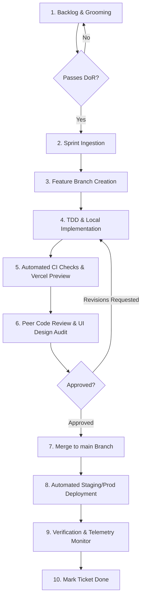

# PhotoMagic Studio OS — Project Execution Blueprint (Phase 0.9)

---

> **Document Status**: Master Project Execution & Engineering Governance Handbook (v1.0)  
> **Role**: Principal Engineering Manager & Lead Technical Program Manager  
> **Target Engineering Teams**: Core Frontend, Backend, DevOps, QA & Product Design  
> **Repository Strategy**: Monorepo (`pnpm` workspaces + Turborepo)  
> **Release Cadence**: 2-Week Sprint Iterations with Continuous Deployment to Staging  

---

## 1. Development Philosophy

PhotoMagic Studio OS adheres to 5 fundamental engineering principles:

1. **Ship Premium Quality First**: No temporary hacks, missing error states, or broken responsive layouts. If a feature is shipped, it must look and feel like an Apple/Stripe product.
2. **Shift-Left Security & Testing**: Security checks, RLS policies, and automated unit/integration tests are written alongside feature code—never deferred.
3. **Automate Continuous Integration**: Every Pull Request must pass static analysis, type checking, linting, and automated test suites before human code review.
4. **Zero-Downtime Serverless Releases**: Database migrations and frontend deployments must be backward-compatible to guarantee zero downtime.
5. **Radical Ownership & Transparency**: Engineers own features end-to-end—from architectural RFC through code implementation, testing, deployment, and production telemetry monitoring.

---

## 2. Repository & Branching Strategy

- **Monorepo Architecture**: `pnpm` workspaces + Turborepo. Single GitHub repository containing all 3 Next.js applications (`apps/*`) and shared packages (`packages/*`).
- **Branching Model**: **Trunk-Based Development with Short-Lived Feature Branches**.

```
  main (Production Branch - Protected)
   │
   ├──> feature/CLT-102-gallery-lightbox  ──(PR / CI Tests / Code Review)──> [ Merge to main ]
   │
   └──> fix/ADM-204-invoice-tax-calc      ──(PR / Fast-track Review)───────> [ Merge to main ]
```

### Naming Conventions
- Features: `feature/{TICKET_ID}-{short-description}` (e.g. `feature/CLT-104-album-pins`)
- Bug Fixes: `fix/{TICKET_ID}-{short-description}` (e.g. `fix/SEC-012-rls-policy`)
- Hotfixes: `hotfix/{TICKET_ID}-{short-description}`

---

## 3. Feature Lifecycle Workflow



---

## 4. Definition of Ready (DoR) & Definition of Done (DoD)

### 4.1 Definition of Ready (DoR)
A user story or engineering task is **Ready for Development** only when:
- [ ] User story copy and business value are clearly defined.
- [ ] UI visual design mockup or ASCII wireframe is attached.
- [ ] API payload contract / DB schema impact is agreed upon.
- [ ] Acceptance criteria (AC) are written in Gherkin `Given-When-Then` format.
- [ ] Story points estimated by the engineering team (Fibonacci scale: 1, 2, 3, 5, 8).

### 4.2 Definition of Done (DoD)
A feature is considered **Done** and ready for production release only when:
- [ ] Code compiles cleanly with zero TypeScript errors (`pnpm type-check`).
- [ ] ESLint rules pass with zero warnings (`pnpm lint`).
- [ ] Unit & Integration tests written and passing (>80% statement coverage on business logic).
- [ ] Database migrations tested locally via Supabase CLI.
- [ ] PostgreSQL Row Level Security (RLS) policies verified for multi-tenant isolation.
- [ ] Responsive design verified on Mobile (375px), Tablet (768px), and Desktop (1440px).
- [ ] Light & Dark theme visual states verified.
- [ ] Mobile touch targets (48x48dp minimum) and keyboard focus rings verified.
- [ ] Vercel Preview URL tested and approved by Product Designer.
- [ ] Pull Request reviewed and approved by at least 2 Senior Engineers.

---

## 5. Code Review & QA Checklists

### 5.1 Senior Engineer Code Review Checklist

```markdown
## Code Review Verification Checklist

### 1. Architecture & Code Hygiene
- [ ] Follows Monorepo package boundary rules (no circular dependencies).
- [ ] Server Components used by default; `'use client'` only where necessary.
- [ ] No inline `any` types; Zod validation schemas applied to external inputs.
- [ ] Error boundaries and non-destructive fallbacks implemented.

### 2. Security & Data Isolation
- [ ] All database queries include compulsory `workspace_id` filtering.
- [ ] Supabase RLS policy written and verified for new tables.
- [ ] Presigned R2 URLs used for media storage (no binary blobs in API responses).
- [ ] HMAC signature verified on external webhook endpoints.

### 3. Performance & Ergonomics
- [ ] Large photo arrays use DOM virtualization (`@tanstack/react-virtual`).
- [ ] BlurHash progressive placeholders implemented on new image elements.
- [ ] No un-memoized heavy calculations inside render loops.
```

---

## 6. Comprehensive Testing Strategy

```
                          +-------------------------+
                          |   End-to-End Tests      |  Playwright (Core User Flows)
                          |       (10% Volume)      |
                          +-------------------------+
                          |   Integration Tests     |  Supabase Local CLI + Vitest
                          |       (30% Volume)      |  (API, RLS & Server Actions)
                          +-------------------------+
                          |      Unit Tests         |  Vitest + React Testing Library
                          |       (60% Volume)      |  (UI Components & Utilities)
                          +-------------------------+
```

| Testing Tier | Tooling | Focus & Scope | Execution Trigger |
|:---|:---|:---|:---|
| **Unit Testing** | Vitest + RTL | Utility logic, currency math, UI component rendering, state hooks. | Pre-commit / PR CI Pipeline |
| **Integration Testing** | Vitest + Supabase Local DB | Database RLS verification, Server Actions, invoice status transitions. | PR Merge Pipeline |
| **E2E Testing** | Playwright | Full booking flow, Client portal photo proofing, Album sign-off, Razorpay checkout. | Nightly Staging Pipeline |
| **Accessibility Testing** | @axe-core/playwright | WCAG 2.1 AA contrast, keyboard navigation, aria-labels. | PR CI Pipeline |
| **Performance Testing** | Vercel Speed Insights | Core Web Vitals (LCP < 2.5s, INP < 200ms, CLS < 0.1). | Post-Deployment |

---

## 7. CI/CD & Deployment Workflow

### 7.1 GitHub Actions CI Pipeline Matrix
```yaml
# .github/workflows/ci.yml Pipeline Trigger
name: Continuous Integration
on:
  pull_request:
    branches: [main]

jobs:
  quality-gate:
    runs-on: ubuntu-latest
    steps:
      - uses: actions/checkout@v4
      - uses: pnpm/action-setup@v3
      - name: Install Dependencies
        run: pnpm install --frozen-lockfile
      - name: TypeScript Verification
        run: pnpm type-check
      - name: ESLint Verification
        run: pnpm lint
      - name: Run Vitest Suite
        run: pnpm test:unit
      - name: Build Dry Run
        run: pnpm build
```

---

## 8. Rollback & Disaster Recovery Strategy

1. **Frontend Instant Rollback**: Vercel Instant Deployment Rollback. Single-click revert to previous deployment SHA (< 10 seconds).
2. **Database Backward Compatibility Rule**:
   - **Phase 1**: Add new column as `NULLABLE`. Deploy updated application code.
   - **Phase 2**: Backfill historical data.
   - **Phase 3**: Apply `NOT NULL` constraint in subsequent migration.
3. **Database Restore**: Point-in-Time Recovery (PITR) continuous WAL logs on Supabase PostgreSQL.

---

## 9. Risk Register Template

| Risk ID | Identified Risk | Impact | Probability | Mitigation Strategy | Owner |
|:---|:---|:---:|:---:|:---|:---|
| **RSK-01** | High-res photo upload drops due to weak mobile connection. | High | Medium | Implement S3 Multipart resumable direct R2 uploads with auto-retry. | Backend Lead |
| **RSK-02** | RLS policy misconfiguration leaks Client A photos to Client B. | Critical | Low | Automated integration tests running multi-tenant isolation suites on every PR. | Security Lead |
| **RSK-03** | Rapid photo selection triggers database write lock contention. | Medium | Medium | Use optimistic UI state locally + batched server action updates. | Frontend Lead |

---

## 10. Engineering KPIs & Success Metrics

| Metric Category | Key Performance Indicator (KPI) | Target Benchmark |
|:---|:---|:---|
| **Code Quality** | Automated Test Code Coverage | $\ge 80\%$ Statement Coverage |
| **Velocity** | PR Lead Time (Creation to Merge) | $< 24$ Hours |
| **Performance** | Largest Contentful Paint (LCP) | $< 2.2$ Seconds (Mobile 4G) |
| **Reliability** | Production Uptime SLA | $99.95\%$ Uptime |
| **Security** | Zero-Day Critical Vulnerability Resolution | $< 4$ Hours |

---

## Summary & Next Steps

This **Project Execution Blueprint** serves as the definitive engineering governance handbook for PhotoMagic Studio OS. All developers, technical program managers, and QA engineers must strictly follow these branching, testing, review, and release standards throughout the project lifecycle.
