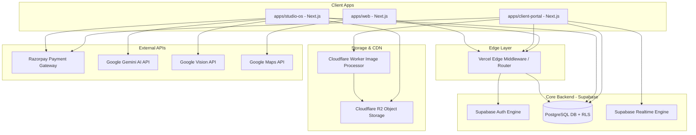
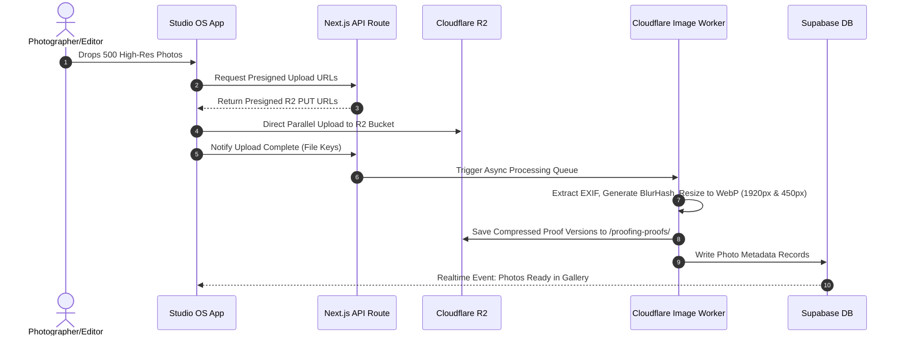

# PhotoMagic Studio OS — System Architecture & Technology Blueprint (Phase 0.4)

---

> **Document Status**: Master Engineering Blueprint (v1.0)  
> **Role**: Senior Software Architect  
> **Target Audience**: Core Engineering Team, DevOps, Lead Developers  
> **Repository Model**: Monorepo (pnpm Workspaces + Turborepo)  
> **Infrastructure Model**: Serverless / Edge First (Vercel + Supabase + Cloudflare R2)  

---

## 1. Complete System Architecture

PhotoMagic Studio OS is architected as an Edge-First, Serverless Multi-Application Monorepo. It cleanly decouples user-facing web applications, client experience portals, studio operations, background processing workers, and media storage pipelines.

### ASCII Architecture Overview

```
+---------------------------------------------------------------------------------------------------+
|                                      CLIENT INTERFACE LAYER                                       |
|  +--------------------+    +-----------------------+    +-------------------+   +------------------+  |
|  |   apps/web         |    |   apps/client-portal  |    |   apps/studio-os  |   |  Native iOS/Android| |
|  |   (Public Website) |    |   (Client Experience) |    |   (Staff / Owner) |   |  (Future PWA/App)| |
|  +---------+----------+    +-----------+-----------+    +---------+---------+   +--------+---------+  |
+------------|---------------------------|--------------------------|--------------------|----------+
             |                           |                          |                    |
             +---------------------------+------------+-------------+--------------------+
                                                      |
                                                      v
+---------------------------------------------------------------------------------------------------+
|                                  EDGE & MIDDLEWARE GATEWAY (Vercel)                               |
|  - Next.js App Router Server Actions & Route Handlers                                             |
|  - Auth Session Validation (Supabase Auth SSR Middleware)                                         |
|  - Tenant / Domain Router (Custom Client Subdomains)                                              |
|  - Edge Caching & Compression (Brotli / WebP)                                                     |
+-------------------------------------------------------+-------------------------------------------+
                                                        |
         +----------------------------------------------+----------------------------------+
         |                                              |                                  |
         v                                              v                                  v
+------------------------------------+  +--------------------------------+  +--------------------------------+
|      BACKEND SERVICES LAYER        |  |     MEDIA & CONTENT STORAGE    |  |     EXTERNAL INTEGRATIONS      |
|                                    |  |                                |  |                                |
|  +------------------------------+  |  |  +--------------------------+  |  |  +--------------------------+  |
|  | Supabase Postgres (Database) |  |  |  | Cloudflare R2           |  |  |  | Razorpay / Stripe       |  |
|  | - Row Level Security (RLS)   |  |  |  | (RAW / High-Res / Zips)  |  |  |  | (Payments & Webhooks)    |  |
|  | - Realtime Subscriptions     |  |  |  +--------------------------+  |  |  +--------------------------+  |
|  | - pgvector (Smart Search)    |  |  |  +--------------------------+  |  |  +--------------------------+  |
|  +------------------------------+  |  |  | Cloudflare Image Worker  |  |  |  | Gemini API & Vision API  |  |
|  +------------------------------+  |  |  | (On-demand WebP/BlurHash)|  |  |  | (AI Smart Culling/Tag)   |  |
|  | Supabase Auth                |  |  |  +--------------------------+  |  |  +--------------------------+  |
|  | (JWT / Magic Link / Passkey) |  |  |                                |  |  +--------------------------+  |
|  +------------------------------+  |  +--------------------------------+  |  | Google Maps API          |  |
+------------------------------------+                                      |  | (Venue & Logistics)      |  |
                                                                            |  +--------------------------+  |
                                                                            +--------------------------------+
```

---

## 2. High-Level Component Diagram



---

## 3. Deployment Architecture

| Tier | Provider / Technology | Description & Responsibility |
|:---|:---|:---|
| **Edge & Frontend** | **Vercel Enterprise / Pro** | Deploys Next.js App Router applications across global Edge nodes with zero-cold-start Serverless Functions. |
| **Primary Database & Auth** | **Supabase Cloud (AWS)** | Managed PostgreSQL 15+ instance with pooling via PgBouncer, auto-scaling storage, automated WAL backups, and Supabase Auth. |
| **Heavy Asset Storage** | **Cloudflare R2** | Stores RAW uploads, proofing web assets, final delivered high-res JPEGs, and zip archives with **zero egress fee** economics. |
| **Media Processing** | **Cloudflare Workers / Image Resizing** | On-the-fly image resizing, AVIF/WebP conversion, metadata stripping, and BlurHash extraction. |
| **CDN & DNS** | **Cloudflare Enterprise DNS** | DDoS protection, SSL termination, custom domain routing for client portals, and caching layers. |

---

## 4. Frontend Architecture

- **Framework**: Next.js 14+ with App Router (`/app` directory architecture).
- **Rendering Strategy**:
  - **Static Site Generation (SSG)** & **Incremental Static Regeneration (ISR)**: Public studio website & portfolio stories (`apps/web`).
  - **Server-Side Rendering (SSR)** & **React Server Components (RSC)**: Initial authenticated portal loads (`apps/client-portal` & `apps/studio-os`).
  - **Client-Side Rendering (CSR)** & **React Suspense**: Interactive gallery proofing, side-by-side compare slider, and 3D album spread canvas.
- **State Management**:
  - **Server State**: React Query (TanStack Query v5) / Server Actions for caching, mutation invalidation, and optimistic UI updates.
  - **UI / Client State**: Zustand for lightweight local application state (lightbox open state, compare mode selections, drawer toggles).
- **Styling & Motion**:
  - **Tailwind CSS v3/v4**: Utility-first CSS with custom luxury token design system (glassmorphic variables, dark/light mode HSL palette).
  - **Framer Motion**: Page transitions, drawer slide-overs, gallery layout animations, gesture physics.
  - **GSAP (GreenSock)**: Complex cinematic scroll animations on public showcase site.

---

## 5. Backend Architecture

- **Paradigm**: Serverless & Database-Centric Architecture with PostgreSQL Row Level Security (RLS).
- **Core Database Engine**: Supabase Managed PostgreSQL.
- **Business Logic Layer**:
  - **Next.js Server Actions**: Type-safe mutation handlers executed directly on Vercel Serverless Functions.
  - **Next.js Route Handlers**: RESTful endpoints for external webhooks (Razorpay/Stripe events) and binary file uploads.
  - **Database Functions & Triggers**: PL/pgSQL functions for atomic operations (e.g., updating gallery photo count, generating invoice numbers).
- **Async & Background Jobs**:
  - **Vercel Cron**: Scheduled daily tasks (payment reminders, draft cleanup, daily studio digest).
  - **Inngest / Trigger.dev**: Reliable background queue for heavy tasks (zip packaging, bulk image AI tagging, email batch dispatch).

---

## 6. Monorepo Structure

Managed via **pnpm Workspaces** + **Turborepo**.

```
photo-magic-monorepo/
├── apps/
│   ├── web/                    # Public Studio Website & Lead Engine (Next.js)
│   ├── client-portal/          # Private Client Experience & Proofing Hub (Next.js)
│   └── studio-os/              # Admin Command Center & Staff Workspace (Next.js)
├── packages/
│   ├── ui/                     # Shared UI Component Library (React, Tailwind, Framer Motion)
│   ├── database/               # Supabase Client, Prisma/Kysely Schema, Migrations, RLS Types
│   ├── auth/                   # Supabase Auth SSR Middleware & RBAC Utilities
│   ├── storage/                # Cloudflare R2 SDK Wrapper & Presigned URL Generator
│   ├── payments/               # Razorpay / Stripe Adapters & Webhook Handlers
│   ├── ai/                     # Google Gemini & Vision API Service Adapters
│   ├── typescript-config/      # Shared tsconfig.json configurations
│   ├── eslint-config/          # Shared ESLint rules
│   └── tailwind-config/        # Shared Tailwind CSS design system tokens
├── turbo.json                  # Turborepo task pipeline configuration
├── pnpm-workspace.yaml         # pnpm workspace definition
└── package.json                # Root package manifest
```

---

## 7. Package Organization

| Package Name | Scope | Exports / Responsibilities |
|:---|:---|:---|
| `@photomagic/ui` | Shared UI | Buttons, Modals, Drawers, Glass Cards, Typography, Icons, Skeleton Loaders. |
| `@photomagic/database` | Data Access | Supabase browser/server clients, generated TypeScript DB definitions, custom query helpers. |
| `@photomagic/auth` | Identity | Auth context providers, session hooks, RBAC permission checkers (`hasPermission()`). |
| `@photomagic/storage` | Object Storage | R2 bucket client, presigned upload/download URL generator, multipart upload manager. |
| `@photomagic/payments` | Financials | Razorpay instance initializer, signature verification, invoice payload builders. |
| `@photomagic/ai` | AI Engine | Gemini prompt templates, Vision API image analyzer for auto-culling & tagging. |

---

## 8. Shared Library Strategy

- **Single Source of Truth**: All domain types (e.g., `Client`, `Gallery`, `Photo`, `AlbumSpread`, `Invoice`) are defined in `@photomagic/database` and re-exported across all applications.
- **Component Consistency**: Applications (`apps/*`) consume visual primitives exclusively from `@photomagic/ui` to guarantee 100% aesthetic uniformity across public sites, client portals, and admin dashboards.
- **Zero Duplication Policy**: Utility functions (formatting currency, calculating deposit %, image URL transformation) reside in `@photomagic/ui/utils` or `@photomagic/database/utils`.

---

## 9. Authentication Architecture

```
[ User ] ──> [ Magic Link / Passwordless ] ──> [ Supabase Auth ] ──> [ Issue Signed JWT Cookie ]
                                                                             │
                                                                             v
[ Protected Route ] <── [ Verify JWT & Session ] <── [ Next.js SSR Middleware ]
```

- **Primary Authentication Provider**: **Supabase Auth**.
- **Auth Methods Supported**:
  1. **Magic Link (Passwordless Email/SMS)**: Primary frictionless login for Clients.
  2. **Biometric Passkey (WebAuthn / Apple TouchID/FaceID)**: Frictionless client re-authentication.
  3. **Email + Secure Password**: For Studio Owners and Staff.
  4. **OAuth 2.0 (Google Workspace)**: One-click login for Studio Staff.
- **Session Management**:
  - Encrypted HTTP-Only, SameSite=Lax cookies managed via `@supabase/ssr`.
  - Automatic JWT refresh token rotation.

---

## 10. Authorization Strategy (RBAC + Row Level Security)

Authorization is enforced at **two distinct levels**:

1. **Application Level (Next.js Middleware + Component Gates)**
2. **Database Level (PostgreSQL Row Level Security - RLS)**

### 10.1 Persona Role Matrix

| Role | Access Scope | Workspace Isolation |
|:---|:---|:---|
| `super_admin` | Full System Access | Multi-Tenant Global |
| `studio_owner` | Full Studio Management, Financials, Staff Control | Single Tenant (`workspace_id`) |
| `reception_sales` | Leads, CRM, Bookings, Contracts | Single Tenant (`workspace_id`) |
| `photographer` | Assigned Shoots, Field Briefs, Shot Lists | Single Tenant (`workspace_id`) |
| `videographer` | Assigned Shoots, Video Logs | Single Tenant (`workspace_id`) |
| `editor` | Assigned Media Collections, Retouching Queue | Single Tenant (`workspace_id`) |
| `album_designer` | Assigned Album Proofing Workspaces | Single Tenant (`workspace_id`) |
| `client` | Specific Event Portal, Own Proofing Gallery | Client ID + Event PIN |
| `visitor` | Public Portfolio & Booking Form | Unauthenticated |

### 10.2 Database RLS Example (PostgreSQL)

```sql
-- Enforce workspace multi-tenant isolation on Galleries table
ALTER TABLE galleries ENABLE ROW LEVEL SECURITY;

-- Owner & Staff Policy
CREATE POLICY "Staff workspace access policy" ON galleries
FOR ALL USING (
  workspace_id = (SELECT workspace_id FROM profiles WHERE id = auth.uid())
);

-- Client Specific Access Policy
CREATE POLICY "Client gallery proofing access" ON galleries
FOR SELECT USING (
  client_id = auth.uid() AND status IN ('proofing_ready', 'delivered')
);
```

---

## 11. Storage Architecture

```
                      +----------------------------------+
                      |         Cloudflare R2            |
                      |                                  |
                      |  Bucket: /raw-uploads/           |
                      |  Bucket: /proofing-proofs/       |
                      |  Bucket: /final-deliveries/      |
                      |  Bucket: /zips/                  |
                      +----------------------------------+
                                       ^
                                       | Presigned Direct Upload / Download
                                       |
+---------------------+     +-----------------------+     +-------------------+
|  Client Browser     |     |  Next.js Server       |     |  Supabase Postgres|
|  (Direct Upload)    | <-> |  (Issues Presigned    | <-> |  (Stores Metadata |
|                     |     |   R2 URLs)            |     |   & File Paths)   |
+---------------------+     +-----------------------+     +-------------------+
```

- **Metadata Storage**: File metadata (filename, byte size, dimensions, EXIF tags, BlurHash string, R2 key path) stored in Supabase PostgreSQL.
- **Heavy Media Object Storage**: **Cloudflare R2** buckets:
  - `photomagic-raw`: Original uncompressed camera RAW files.
  - `photomagic-proofs`: Web-optimized webp proofs for client selection.
  - `photomagic-deliveries`: High-res final retouched JPEGs.
  - `photomagic-archives`: Generated client zip bundles.
- **Why R2 over Supabase Storage / S3?**: **Zero Egress Fees**. A single high-res wedding delivery zip can be 15GB+. Free egress saves thousands in cloud costs.

---

## 12. Media Processing Pipeline



---

## 13. API Design Principles

- **Primary Mutation API**: **Next.js Server Actions**. Provides end-to-end TypeScript safety without manual API endpoint definition.
- **RESTful Endpoints**: Used exclusively for webhook ingest (`/api/webhooks/razorpay`) and public external integrations.
- **Type Safety**: Built with **Zod** schema validation for all incoming input payloads.
- **Standardized Response Contract**:

```typescript
type APIResponse<T> = 
  | { success: true; data: T; timestamp: string }
  | { success: false; error: { code: string; message: string; details?: unknown }; timestamp: string };
```

---

## 14. Database Strategy

- **Engine**: PostgreSQL 15+ hosted on Supabase.
- **Key Schemas**:
  - `public`: Core operational entities (`workspaces`, `profiles`, `clients`, `events`, `galleries`, `photos`, `albums`, `invoices`).
  - `analytics`: Audit logs, view counts, gallery activity telemetry.
- **Indexing Strategy**:
  - B-Tree indexes on all Foreign Keys (`workspace_id`, `client_id`, `event_id`, `gallery_id`).
  - GIN indexes on JSONB fields (e.g. `photos.metadata`, `albums.spread_layout`).
  - `pgvector` index on photo embeddings for future AI visual similarity search.

---

## 15. Logging Strategy

- **Structured JSON Logging**: Every log entry formatted as structured JSON containing `timestamp`, `level`, `workspace_id`, `user_id`, `trace_id`, and `context`.
- **Log Levels**: `DEBUG` | `INFO` | `WARN` | `ERROR` | `FATAL`.
- **Log Aggregator**: Integrated with **Axiom** / **Datadog** via Vercel Log Drains.

---

## 16. Monitoring Strategy

- **Application Performance Monitoring (APM)**: **Sentry** for real-time frontend/backend runtime exception tracking and stack traces.
- **Vercel Speed Insights & Web Vitals**: Continuous monitoring of Core Web Vitals (LCP, FID/INP, CLS).
- **Supabase Metrics**: Real-time monitoring of DB CPU usage, IOPS, connection pool saturation, and slow queries (>100ms).

---

## 17. Error Handling Strategy

- **Global Error Boundaries**: Next.js `error.tsx` component boundaries catching rendering exceptions gracefully with luxury-styled fallback cards.
- **Server Action Error Wrapping**: All Server Actions wrapped in a unified try-catch utility (`tryAction()`) returning typed error objects instead of unhandled promise rejections.
- **Client Offline Auto-Recovery**: Network retry mechanism with exponential backoff for image liking and selection sync.

---

## 18. Performance Strategy

- **Image Virtualization**: Render maximum 30 DOM nodes in gallery view regardless of total photos (5,000+) using `@tanstack/react-virtual`.
- **Blur-Up Progressive Image Loading**: Display inline low-byte BlurHash placeholders before image fade-in.
- **CDN Edge Caching**: Cache public portfolio assets at Cloudflare edge with `stale-while-revalidate=86400`.
- **Bundle Optimization**: Tree-shaking heavy libraries (e.g., dynamically importing GSAP/Framer Motion modules only when canvas mounts).

---

## 19. Security Blueprint

- **Data at Rest**: AES-256 encryption on Cloudflare R2 and Supabase PostgreSQL disk storage.
- **Data in Transit**: Mandatory TLS 1.3 across all client-server communication.
- **Content Security Policy (CSP)**: Strict headers mitigating XSS attacks.
- **Pre-signed Access Expiration**: R2 download links for raw media expire after 15 minutes.
- **Rate Limiting**: Upstash Redis rate limiting on public inquiry forms (max 5 requests per IP per minute).

---

## 20. Backup & Disaster Recovery (DR)

- **Point-in-Time Recovery (PITR)**: Supabase PostgreSQL continuous WAL archiving allowing restoration to any precise second within 7 days.
- **Daily Automated Storage Snapshots**: Cloudflare R2 multi-region bucket replication for mission-critical client deliverables.
- **RTO (Recovery Time Objective)**: < 1 Hour.
- **RPO (Recovery Point Objective)**: < 5 Minutes.

---

## 21. Scalability Strategy

- **Stateless Compute**: Next.js applications on Vercel scale automatically to thousands of concurrent users with zero infrastructure configuration.
- **Database Connection Management**: PgBouncer pooling handles thousands of simultaneous serverless connections to PostgreSQL.
- **Storage Scalability**: Cloudflare R2 automatically scales storage capacity to petabytes without throughput degradation.

---

## 22. Multi-Workspace (Multi-Tenant) Readiness

```sql
-- Core Tenant Hierarchy Schema pattern
CREATE TABLE workspaces (
  id UUID PRIMARY KEY DEFAULT gen_random_uuid(),
  name TEXT NOT NULL,
  slug TEXT UNIQUE NOT NULL,
  custom_domain TEXT UNIQUE,
  created_at TIMESTAMPTZ DEFAULT now()
);

-- Every core data table contains workspace_id
ALTER TABLE clients ADD COLUMN workspace_id UUID REFERENCES workspaces(id) ON DELETE CASCADE;
ALTER TABLE galleries ADD COLUMN workspace_id UUID REFERENCES workspaces(id) ON DELETE CASCADE;
```

- Multi-tenancy achieved via **Workspace Isolation Column (`workspace_id`)** combined with automatic database Row Level Security policies.
- Custom client domain mapping supported out-of-the-box via Cloudflare Custom Hostnames (SSL for SaaS).

---

## 23. Environment Strategy

| Environment | URL Pattern | Database Instance | Storage Bucket |
|:---|:---|:---|:---|
| **Development** | `localhost:3000` | Supabase Local CLI / Branch | `photomagic-dev-r2` |
| **Staging** | `*.vercel.app` | Supabase Staging Project | `photomagic-staging-r2` |
| **Production** | `photomagic.studio` / App domains | Supabase Production Tier | `photomagic-prod-r2` |

---

## 24. CI/CD Recommendations

- **Version Control**: GitHub with strict branch protection rules on `main`.
- **Automated Pipeline** (GitHub Actions + Vercel):
  1. `pnpm lint` & `pnpm type-check` on every Pull Request.
  2. Automated unit & integration tests (`vitest`).
  3. Vercel Preview Deployments for every PR branch.
  4. Automatic Supabase DB migration dry-run on staging.
  5. Merge to `main` triggers production deployment with zero downtime.

---

## 25. Folder Naming Standards

- **Apps & Packages**: Kebab-case (e.g. `client-portal`, `studio-os`, `typescript-config`).
- **Next.js App Router Routes**: Kebab-case directories (e.g., `app/(portal)/album-proof/page.tsx`).
- **Component Folders**: PascalCase (e.g., `components/GalleryCard/Index.tsx`).

---

## 26. File Naming Standards

- **React Components**: PascalCase (e.g. `WelcomeHeader.tsx`, `SelectionSummary.tsx`).
- **Hooks & Utilities**: camelCase (e.g. `useGallerySelection.ts`, `formatCurrency.ts`).
- **Server Actions & API Routes**: camelCase or `route.ts` / `action.ts`.
- **Styles**: `*.module.css` or global `globals.css`.

---

## 27. TypeScript Standards

- **Strict Mode**: `"strict": true` enforced across all `tsconfig.json` files.
- **No `any` Policy**: Use `unknown` with Zod parsing instead of `any`.
- **Explicit Return Types**: All exported functions and Server Actions must specify explicit return signatures.

---

## 28. Coding Guidelines

1. **Server Components First**: Default to React Server Components (RSC); use `'use client'` only when interactive state, hooks, or event listeners are required.
2. **Immutability**: Maintain strict state immutability in Zustand stores and React state hooks.
3. **No Direct DB Calls in Client Components**: All DB access must go through Server Actions or typed API service wrappers.

---

## 29. Documentation Structure

```
docs/
├── client-experience-blueprint.md           # Phase 0.1 Client Experience
├── client-journey-and-information-architecture.md
├── ux-architecture-blueprint.md              # Phase 0.3 UX Architecture Blueprint
├── system-architecture-blueprint.md          # Phase 0.4 Master Engineering Blueprint
├── api/                                      # API & Server Action Specifications
└── database-schema.md                        # Complete Entity Relationship Specs
```

---

## 30. Architecture Risks & Mitigation Matrix

| Identified Risk | Severity | Impact | Mitigation Strategy |
|:---|:---:|:---|:---|
| **Egress Cost Explosion** | High | Massive cloud bills from high-res image distribution. | Use **Cloudflare R2** (Zero Egress fees) for all media asset downloads. |
| **Gallery Performance Degradation** | High | UI freezes when rendering 2,000+ photo DOM nodes. | Mandatory **DOM Virtualization** (`@tanstack/react-virtual`) & BlurHash skeleton loading. |
| **Cross-Tenant Data Leakage** | Critical | Client A views Client B's private photos. | Enforce multi-tenant **PostgreSQL Row Level Security (RLS)** at database tier. |
| **Upload Network Disruption** | Medium | Large SD card uploads fail midway due to connection drop. | Implement **Multipart Resumable Uploads** directly from browser to R2 via S3 SDK chunking. |

---

## Summary & Next Steps

This **System Architecture & Technology Blueprint** establishes the definitive technical foundation for PhotoMagic Studio OS v1.0. All future development, monorepo package setups, database schemas, and API implementations must adhere strictly to these architectural specifications.
