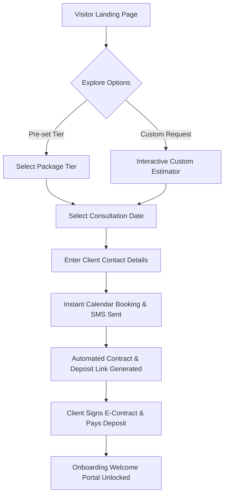
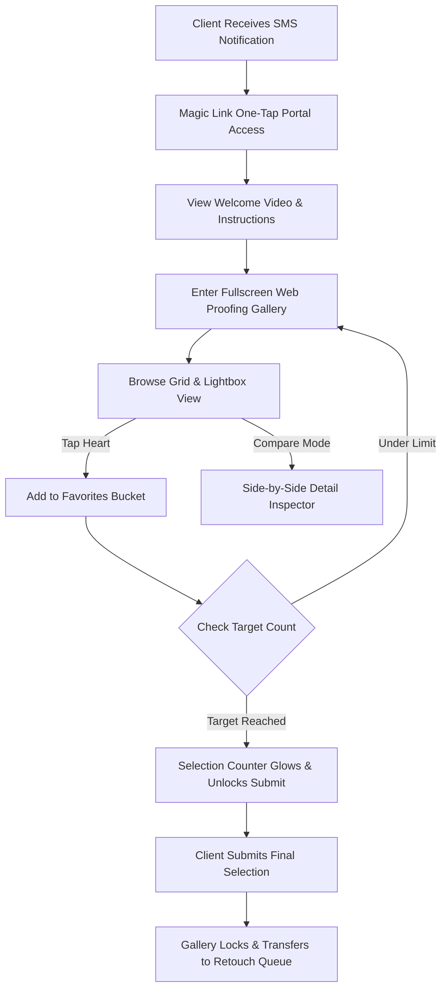

# PhotoMagic Studio OS — UX Architecture Blueprint (Phase 0.3)

---

> **Document Status**: Complete Architecture Blueprint  
> **Role**: Senior Product Designer & Lead UX Architect  
> **Target Platform**: Responsive Web / Mobile-First Web App  
> **Design Inspirations**: Apple, Linear, Stripe, Airbnb, Leica, Notion, Netflix  
> **Design Ethos**: Luxury, Minimalist, Cinematic, Frictionless, Mobile-Native, Timeless  

---

## Executive Overview

PhotoMagic Studio OS is a next-generation luxury photography studio management platform. It bridges the gap between high-touch, concierge-level client experiences and modern, hyper-efficient studio operations. 

This UX Architecture Blueprint defines the complete human-computer interaction model, information architecture, navigation systems, multi-persona user journeys, spatial wireframe standards, and state feedback systems across all 9 user personas.

---

## 1. User Journey Maps

### 1.1 Visitor Journey (Public Experience)
```
[ Discovery ] ──> [ Cinematic Portfolio ] ──> [ Interactive Estimator ] ──> [ Inquiry / Consultation ]
  - Instagram        - Hero Video Reel          - Package Exploration         - Smart Calendar Booking
  - Referral         - High-Res Stories         - Add-on Customizer           - Pre-consult Questionnaire
  - Search           - Client Testimonials      - Live Cost Estimate          - Auto SMS Confirmation
```
- **Phase 1: Discovery & Impression**
  - **Goal**: Experience spatial luxury and visual excellence immediately.
  - **Key Actions**: Views full-screen video reel, browses curated story collections (Weddings, Commercial, Portraits).
  - **UX Touchpoints**: Zero-clutter typography, auto-playing ambient background video (muted), smooth cursor glow (desktop) or smooth scroll snapping (mobile).
- **Phase 2: Intent & Exploration**
  - **Goal**: Evaluate studio fit and style without friction.
  - **Key Actions**: Explores pricing tiers or builds a custom package estimate.
  - **UX Touchpoints**: Interactive slider component with real-time summary calculation; transparent pricing without hidden fees.
- **Phase 3: Conversion**
  - **Goal**: Book a discovery consultation or submit an inquiry.
  - **Key Actions**: Selects available slot on interactive calendar, enters client details, submits inquiry.
  - **UX Touchpoints**: Auto-filled fields via magic links or browser auto-complete; instant calendar invite (.ics + Google Calendar sync).

---

### 1.2 Client Journey (Lifecycle Management)
```
[ Lead Inquiry ] ──> [ Onboarding Portal ] ──> [ Pre-Shoot Planning ] ──> [ Shoot Day Experience ]
        │                   │                         │                         │
        ▼                   ▼                         ▼                         ▼
[ Final Delivery ] <── [ Album Approval ] <── [ Gallery Selection ] <── [ Raw Proofing Upload ]
```
- **Touchpoint 1: Welcome & Onboarding**
  - Receives personal SMS/Email invitation to private Client Portal.
  - One-touch magic link authentication (Passwordless biometric / PIN link).
  - Welcome video message from lead photographer.
- **Touchpoint 2: Pre-Shoot Collaboration**
  - Fills out moodboard / shot list preferences.
  - Views timeline countdown and venue logistics map.
  - Signs contract with digital signature; pays deposit via Apple Pay / Stripe.
- **Touchpoint 3: Proofing & Curation**
  - Receives notification when initial web proofs are ready.
  - Engages with ambient fullscreen grid, flags favorites (`Heart`), leaves visual comments.
  - Triggers selection locking when target selection count is reached.
- **Touchpoint 4: Album Co-Design & Approval**
  - Reviews double-page spread album preview with realistic flip animation.
  - Drops precision visual comment pins on specific image regions requiring retouching/swaps.
  - One-click final sign-off lock with digital audit trail.
- **Touchpoint 5: Archive & Advocacy**
  - Download high-res / web-res zip packages with single-use PIN security.
  - Direct sharing to family members with customized access privileges.
  - Integrated one-tap review submission and print store order placement.

---

### 1.3 Staff Journey (Operations & Production)
```
[ Daily Schedule ] ──> [ Shoot Brief / Gear ] ──> [ Asset Ingestion ] ──> [ Editing & QA ] ──> [ Client Handoff ]
  - Assigned Shoots      - Shot List Sync          - SD Card Import          - Color Grading           - Automated Release
  - Logistics Map        - Client Moodboard        - AI Smart Culling        - Retouch QA              - Client Notification
```
- **Photographer & Videographer**: Mobile-optimized field view with offline access to shot lists, venue maps, emergency contacts, and gear checklists.
- **Editor**: Desktop focused grid layout for bulk tagging, metadata editing, color state management, and status updates (Imported -> Culled -> Retouched -> Delivered).
- **Album Designer**: Split-screen view comparing client proofing requests with high-res layout spread canvases.

---

### 1.4 Owner Journey (Studio Command & Intelligence)
```
[ Executive Dashboard ] ──> [ Lead Pipeline ] ──> [ Production Pipeline ] ──> [ Revenue & Financials ]
  - Revenue vs Goal          - Drag-and-Drop CRM       - Bottleneck Radar         - Deposit Tracking
  - Studio Capacity          - Automated Nurture       - SLA Monitoring           - Payroll & Payouts
```
- **Executive Command**: Instant high-level health score of the studio (Monthly Recurring Revenue, Lead Conversion %, Production Bottlenecks, Client NPS).
- **Quality Gatekeeping**: One-tap approval for releasing galleries and final album exports before client notification.

---

## 2. Information Architecture (IA)

### 2.1 Global Structure & Sitemap

```
PhotoMagic Studio OS
├── 1.0 Public Studio Site (Visitor Experience)
│   ├── 1.1 Home / Cinematic Showcase
│   ├── 1.2 Portfolio (Weddings | Portraits | Commercial | Films)
│   ├── 1.3 The Studio Experience & Team
│   ├── 1.4 Investment & Custom Builder
│   └── 1.5 Contact & Consultation Booking
│
├── 2.0 Client Experience Portal (Client Experience)
│   ├── 2.1 Overview / Journey Timeline
│   ├── 2.2 Event Shoot Brief & Moodboard Builder
│   ├── 2.3 Contract, Invoices & Payments
│   ├── 2.4 Proofing & Selection Gallery
│   │   ├── 2.4.1 Grid View (Masonry / Fixed Aspect)
│   │   ├── 2.4.2 Cinema Lightbox (Full Screen)
│   │   ├── 2.4.3 Comparison Engine (Side-by-side)
│   │   └── 2.4.4 Favorites & Final Selection Locking
│   ├── 2.5 Interactive Album Layout Review & Sign-Off
│   └── 2.6 Downloads & Print Store
│
└── 3.0 Studio OS Command Center (Staff & Owner Experience)
    ├── 3.1 Studio Intelligence Dashboard
    ├── 3.2 Lead & Sales Pipeline (Kanban / Table)
    ├── 3.3 Bookings & Shoot Calendar
    ├── 3.4 Production Pipeline & Asset Workflows
    │   ├── 3.4.1 Ingestion & Smart Culling Status
    │   ├── 3.4.2 Retouching Queue
    │   └── 3.4.3 Album Proofing Workflow
    ├── 3.5 Client Relationship Directory (CRM)
    ├── 3.6 Financials, Invoices & Payouts
    └── 3.7 Studio Settings & Staff Permissions
```

---

## 3. Screen Inventory

| Screen ID | Screen Name | User Persona | Portal | Primary Purpose | Primary Actions |
|:---|:---|:---|:---|:---|:---|
| **SCR-PUB-01** | Hero Showcase | Visitor | Public | Visual impact & brand story | View Reel, Explore Work |
| **SCR-PUB-02** | Portfolio Grid & Lightbox | Visitor | Public | Portfolio exploration | Filter category, view stories |
| **SCR-PUB-03** | Interactive Investment Builder | Visitor | Public | Transparency & custom pricing | Adjust sliders, select package |
| **SCR-PUB-04** | Booking & Inquiry Screen | Visitor | Public | Lead capture & scheduling | Choose date, fill details |
| **SCR-CLT-01** | Client Hub Dashboard | Client | Client Portal | Central event portal | View countdown, see next action |
| **SCR-CLT-02** | Contract & Invoice Vault | Client | Client Portal | Financials & agreement | Sign e-contract, pay deposit |
| **SCR-CLT-03** | Pre-Shoot Planning Brief | Client | Client Portal | Shoot customization | Add Pinterest link, shot list |
| **SCR-CLT-04** | Web Proofing Gallery | Client | Client Portal | Photo selection | Heart, filter, select, lock |
| **SCR-CLT-05** | Compare & Selection Engine | Client | Client Portal | Side-by-side decision making | Pick winner between 2 photos |
| **SCR-CLT-06** | Album Spread Reviewer | Client | Client Portal | Proofing photo album layout | Pin comments, sign off album |
| **SCR-CLT-07** | Delivery & Download Hub | Client | Client Portal | High-res image download | Zip download, buy prints |
| **SCR-ADM-01** | Owner Control Command | Studio Owner | Studio OS | 360-degree studio health | Monitor revenue, capacity, leads |
| **SCR-ADM-02** | Lead Pipeline Manager | Sales / Owner | Studio OS | Pipeline conversion | Move lead cards, send quotes |
| **SCR-ADM-03** | Production Kanban | Editor / Owner | Studio OS | Track photo/video workflow | Update editing status, assign staff |
| **SCR-ADM-04** | Shoot Logistics & Field Brief | Photographer | Studio OS | Field execution | View shot list, navigate to venue |
| **SCR-ADM-05** | Financial & Payout Ledger | Owner | Studio OS | Cashflow & revenue tracking | Send reminder, track payments |

---

## 4. Navigation System Architecture

### 4.1 Desktop Navigation Hierarchy
- **Top Glass Floating Bar** (Public Site): Dynamic backdrop blur (`backdrop-filter: blur(20px)`), translucent dark acrylic styling. Switches to minimal brand logo + menu on scroll down.
- **Persistent Collapsible Left Rail Sidebar** (Studio OS Command Center):
  - Width: Expanded `260px`, Collapsed `72px`.
  - Top: Workspace Selector (Studio Switcher) + User Profile.
  - Middle: Primary modules (Dashboard, Pipeline, Calendar, Production, CRM, Financials).
  - Bottom: Quick action trigger (`+ New Shoot`), System Settings, Theme Toggle.

### 4.2 Tablet Navigation Hierarchy
- **Split-Pane Architecture**: Left pane lists items (e.g. Clients, Shoots, Galleries), Right pane displays active workspace canvas.
- **Top Contextual Action Bar**: Dynamic action bar that shifts tools depending on active module (e.g. In Gallery Mode: Select All, Filter, Export, Share).

### 4.3 Mobile Navigation Hierarchy (Mobile-First Core)
- **Bottom Glass Control Dock**: 
  - Height: `64px` + safe area inset.
  - Floating `16px` above bottom margin with rounded corners (`border-radius: 32px`).
  - 4 Anchor Tabs:
    1. **Home / Timeline** (Icon + Active Indicator Dot)
    2. **Gallery / Media** (Badge indicator for new uploads)
    3. **Tasks & Approvals** (Pulse notification for actions needed)
    4. **Profile & Billing**
- **Gesture Layer**:
  - Swipe down to dismiss Lightbox & Drawers.
  - Swipe left/right between album spreads or gallery filter tabs.
  - Pinch-to-zoom on image detail views.

---

## 5. Dashboard Layouts (ASCII Wireframes)

### 5.1 Visitor Landing Page (ASCII)
```
+-----------------------------------------------------------------------+
| LOGO                                    Portfolio  Pricing  [BOOK NOW]|
+-----------------------------------------------------------------------+
|                                                                       |
|                     CINEMATIC HERO REEL (VIDEO)                       |
|                     "Capturing Timeless Elegance"                     |
|                                                                       |
|                        [ Explore Portfolio ]                          |
|                                                                       |
+-----------------------------------------------------------------------+
| FEATURED STORIES                                                      |
| +-------------------+  +-------------------+  +-------------------+ |
| | [ Image: Wedding ]|  | [ Image: Portrait]|  | [ Image: Editorial| |
| | Royal Palace      |  | Studio Session    |  | Fashion Week      | |
| +-------------------+  +-------------------+  +-------------------+ |
+-----------------------------------------------------------------------+
```

### 5.2 Client Experience Hub (ASCII Layout)
```
+-----------------------------------------------------------------------+
|  PhotoMagic | Client Portal                    [ Bell (2) ] [ User ]  |
+-----------------------------------------------------------------------+
|                                                                       |
|  WELCOME BACK, ELEANOR & JULIAN                                       |
|  Wedding Event — October 24, 2026 (In 87 Days)                        |
|                                                                       |
|  +-----------------------------------------------------------------+  |
|  | NEXT ACTION REQUIRED                                            |  |
|  | [!] Select 75 Photos for Initial Album Proofing                 |  |
|  | Progress: [========------------] 32 / 75 Selected               |  |
|  |                                                [ Continue Selection ]|
|  +-----------------------------------------------------------------+  |
|                                                                       |
|  JOURNEY TIMELINE                                                     |
|  (v) Deposit Paid  --> (v) Brief Signed --> (*) Proofing --> ( ) Album|
|                                                                       |
|  QUICK ACCESS TILES                                                   |
|  +------------------+  +------------------+  +------------------+     |
|  |  MY GALLERY      |  |  ALBUM PROOF     |  |  PAYMENTS        |     |
|  |  450 Raw Proofs  |  |  Spread 4/18      |  |  Next: $1,500    |     |
|  +------------------+  +------------------+  +------------------+     |
+-----------------------------------------------------------------------+
```

### 5.3 Studio Owner Command Center (ASCII Layout)
```
+-----------------------------------------------------------------------+
| PhotoMagic OS | Studio Command                   Search (Cmd+K)       |
+-----------------------------------------------------------------------+
| [Dash] | REVENUE (MTD)     LEADS CONVERSION    ACTIVE SHOOTS   NPS    |
| [Pipe] | $48,200 (+14%)    68% (12/18)         24 In Production 4.9    |
| [Cal ] +--------------------------------------------------------------+
| [Prod] | PRODUCTION BOTTLENECK RADAR                                  |
| [CRM ] | - 4 Galleries awaiting Owner QA Sign-off                     |
| [Fin ] | - 2 Album revisions overdue by Editor                        |
| [Sett] +--------------------------------------------------------------+
|        | RECENT INQUIRIES                    SHOOT SCHEDULE (THIS WEEK)|
|        | 1. Sarah M. — Oct 12 ($6,500)       Thu: Villa Bella (Photo)  |
|        | 2. David K. — Nov 04 ($4,200)       Sat: Grand Hyatt (Full)   |
+-----------------------------------------------------------------------+
```

---

## 6. Gallery Experience UX

### 6.1 Photo Browsing & Virtualized Grid
- **Virtual Scrolling**: Renders only images currently inside the viewport + 2 buffer screens buffer zone. Handles 5,000+ high-res images smoothly at 60fps.
- **Masonry vs Uniform Aspect Switcher**: User can switch between natural aspect ratio masonry layout and clean square geometry grid.
- **Blur-Up Thumbnail Loading**: Renders low-byte BlurHash placeholders before micro-fade-in of full thumbnail.

### 6.2 Selection & Curation Workflow
- **Heart Toggle**: Hover or tap heart icon on thumbnail to favorite.
- **Selection Meter Floating Bar**:
  - Displays remaining allowed selections (e.g. `Selected: 48 / 75`).
  - Progress bar dynamically animates with spring physics.
  - Warns user when approaching limit (`5 selections left`).
- **Selection Counter Lock**: When target limit is reached, a subtle celebration animation fires, and a prominent `[ Submit Final Selection for Retouching ]` CTA unlocks.

### 6.3 Smart Filtering & Search
- **Filter Chips**:
  - `All Photos` | `Favorites (32)` | `Ceremony (120)` | `Reception (180)` | `Portrait (60)`
- **Metadata Search**: Filter by camera tag, tagged guests, portrait orientation vs landscape, favorited state.

### 6.4 Comparison Engine (Side-by-Side UX)
- Allows client to compare two similar frames (e.g., photo 042 vs photo 043).
- **Split Slider**: Interactive vertical split bar sliding left to right over stacked images.
- **Synchronized Pinch-Zoom**: Zooming into one image zooms into the identical coordinate on the adjacent image for crisp focus verification.

### 6.5 Fullscreen Cinema Viewing Mode
- **Zero-UI Immersion**: Tap image to enter fullscreen. UI chrome auto-hides after 2 seconds of inactivity.
- **Keyboard Shortcuts** (Desktop):
  - `Right Arrow` / `Space`: Next Image
  - `Left Arrow`: Previous Image
  - `F` or `L`: Favorite / Like
  - `C`: Compare Mode
  - `Esc`: Exit Lightbox

---

## 7. Album Approval UX

### 7.1 Interactive Spread Viewer
- **Realistic Flip Simulation**: 3D spread simulation with light reflection shaders mimicking physical luxury paper albums (flush-mount album preview).
- **Spread Thumbnails Strip**: Horizontal strip along the bottom allowing rapid jumping to any spread (Cover, Spread 1-2, Spread 3-4, etc.).

### 7.2 Visual Pin Commenting UX
```
+-----------------------------------------------------------------------+
|  SPREAD 04 - 05                               [ Approving... ]        |
|  +-----------------------------------+-----------------------------+  |
|  |                                   |          [Pin #1]           |  |
|  |           [ Image A ]             |         [ Image B ]         |  |
|  |                                   |                             |  |
|  +-----------------------------------+-----------------------------+  |
|  Sidebar: Pin #1 - "Please swap this photo with #084 from Reception" |  |
+-----------------------------------------------------------------------+
```
- **Pin Placement**: Tap anywhere on a spread to drop a comment pin.
- **Pin Categories**: `Swap Photo`, `Retouching Request`, `Color Adjustment`, `Layout Tweak`.
- **Status Tracking**: Pins update state from `Open` -> `In Progress` -> `Resolved` as studio editor addresses feedback.

### 7.3 Sign-Off Lock & Digital Audit Trail
- Once all spreads are reviewed, client clicks `[ Approve Album Layout ]`.
- Opens digital signature modal with legal verification timestamp, IP address, and spread confirmation checksum.

---

## 8. Appointment Booking UX

```
[ Step 1: Select Type ] ──> [ Step 2: Choose Time ] ──> [ Step 3: Client Details ] ──> [ Step 4: Instant Sync ]
  - Consultation              - Local Timezone            - Name, Event Date            - Google / Apple Cal
  - Moodboard Call            - Live Availability          - Venue, Special Request       - SMS Confirmation
  - Album Review              - Photographer Choice
```
- **Timezone Intelligence**: Auto-detects client timezone with visual confirmation.
- **Smart Buffer Rules**: Auto-blocks 2 hours prior to shoots and prevents double booking across staff calendars.

---

## 9. Booking Flow & Custom Package Builder UX

### 9.1 Package Exploration & Tier Comparison
- Interactive 3-card layout: *Essential*, *Signature (Recommended)*, *Royal Luxury*.
- Highlighted recommended tier with subtle glowing border.

### 9.2 Custom Package Builder (Dynamic Estimator)
```
+-----------------------------------------------------------------------+
| BUILD YOUR CUSTOM STUDIO EXPERIENCE                                   |
+-----------------------------------------------------------------------+
| 1. COVERAGE HOURS                                                     |
| [----|-----------------] 8 Hours ($3,200)                             |
|                                                                       |
| 2. CREW SELECTION                                                     |
| [x] Lead Photographer ($1,200)   [x] Second Photographer ($800)      |
| [x] Cinematic Videographer ($1,800) [ ] Drone Specialist ($600)       |
|                                                                       |
| 3. LUXURY ALBUMS & PRINTS                                             |
| [x] 12x12 Flush Mount Italian Leather Album ($1,400)                  |
| [ ] Parent Mini Albums (Set of 2) ($800)                              |
|                                                                       |
| --------------------------------------------------------------------- |
| ESTIMATED INVESTMENT: $8,400                                          |
| Deposit Due Today (25%): $2,100                                       |
|                                         [ PROCEED TO CONTRACT & RESERV ]|
+-----------------------------------------------------------------------+
```

---

## 10. Notification UX Architecture

### 10.1 Multi-Channel Matrix

| Trigger Event | In-App Glass Banner | Push Notification | SMS / WhatsApp | Email Digest |
|:---|:---:|:---:|:---:|:---:|
| **Gallery Proofs Ready** | Yes | Yes | Yes (Magic Link) | Yes (Visual Hero) |
| **Album Spread Update** | Yes | Yes | Yes | Yes |
| **Payment Invoice Due** | Yes | No | Yes (Direct Link) | Yes |
| **Shoot Tomorrow Alert** | Yes | Yes | Yes (Logistics) | No |
| **Staff Task Assigned** | Yes | Yes | No | No |

---

## 11. Empty States UX

- **Rule**: No plain blank pages. Every empty state must feature:
  1. A custom minimalist line illustration / Leica camera icon.
  2. Encouraging, human copy.
  3. A single primary call-to-action button.

```
+-----------------------------------------------------------------------+
|                                                                       |
|                            [ Camera Icon ]                            |
|                       No Galleries Published Yet                      |
|           Your shoot proofs will appear here after your event.        |
|                                                                       |
|                    [ View Pre-Shoot Preparation Guide ]                |
|                                                                       |
+-----------------------------------------------------------------------+
```

---

## 12. Error States UX

- **Non-Destructive Recovery**: If connection drops during photo selection or upload, selections are cached locally in `localStorage` / `IndexedDB`.
- **Human-Centric Error Banners**: No generic HTTP 500 error codes.
  - *Example*: "We couldn't sync your last 3 image likes due to a brief signal drop. Don't worry—your selections are saved locally and will auto-sync when online."

---

## 13. Loading Experience UX

- **Skeleton Loaders**: Content outlines shaped precisely like target UI components with a soft horizontal pulse shimmer.
- **BlurHash Micro-Fade**: Image thumbnails render a tiny blurred color representation before sliding smoothly into clarity.
- **Progressive Zip Generation**: When generating high-res download zips, display live percentage ring (`Generating Zip... 42%`) with estimated remaining time.

---

## 14. Success States & Micro-Celebrations

- **Deposit Paid**: Gentle confetti wave animation + immediate display of contract PDF download link + welcome countdown launch.
- **Album Sign-Off**: Subtle haptic bump on mobile + animated signature stamp animation over album cover.

---

## 15. Accessibility Considerations (WCAG 2.1 AA Target)

- **Color Contrast**: All primary text maintains a minimum contrast ratio of 4.5:1 against dark (`#0A0A0C`) and light (`#FAFAFC`) backdrops.
- **Keyboard Navigation**: Complete gallery proofing usable via keyboard hotkeys (`1-5`, `F`, `Space`, `Esc`, `Tab`).
- **Screen Reader Compliance**: `aria-label` attributes on visual buttons (e.g. `aria-label="Mark photo 042 as favorite"`).
- **Focus Rings**: High-contrast subtle white/gold glowing focus outline for active element navigation without ruining luxury aesthetic.

---

## 16. Core UX Principles

1. **Uncompromising Spatial Luxury**: Generous whitespace, refined typography, zero administrative clutter.
2. **Instant Visual Gratification**: Media loads instantly via smart caching, blurhashes, and virtualized canvases.
3. **Zero-Friction Client Onboarding**: Passwordless authentication via secure magic links and biometric login.
4. **Contextual Action Clarity**: Always present the single most important next step to the user.
5. **Mobile-Native First**: Every client-facing experience must feel like a high-end native iOS app.

---

## 17. User Flow Diagrams (Mermaid)

### 17.1 Lead-to-Book Flow


### 17.2 Gallery Selection & Proofing Flow


---

## 18. Wireframe Recommendations & Specifications

### 18.1 Gallery Masonry Grid & Selection Drawer (Desktop Wireframe Spec)
- **Top Header**: Glass float, 64px height. Contains back button, event title, category filter pills, selection counter badge (`42/75`), and primary CTA button.
- **Main Canvas**: Flexible 4-column (desktop) or 2-column (mobile) masonry grid with 16px gap spacing.
- **Image Card Unit**:
  - Border radius: `12px`
  - Subtle hover zoom (`scale(1.02)`)
  - Favorite Heart Icon: Top right corner, semi-transparent black pill backdrop.
  - Selection Order Badge: Displays numerical order of selection when active.

---

## 19. Mobile-First Interaction Rules

1. **Touch Target Size**: Minimum target zone of `48x48dp` for all buttons and interactive icons.
2. **Thumb Zone Mapping**: Primary actions placed in the bottom 30% natural thumb reach area.
3. **Haptic Feedback Triggers**:
  - Short vibration on favoriting an image (`impactLight`).
  - Double pulse vibration on album approval completion (`impactMedium`).
4. **Pull-to-Refresh**: Natural drag gesture to refresh gallery proofing status.

---

## 20. Premium Micro-Animation & Delight Moments

1. **Curtain Reveal Transition**: When opening a client gallery, screen darkens subtly and images slide upward with staggered entrance physics.
2. **Interactive Canvas Pan & Zoom**: Smooth inertia physics when panning inside high-res image detail.
3. **Ambient Responsive Glow**: Background subtle radial gradient moves slightly based on mouse position or device tilt (gyroscope).
4. **Interactive Album Spread Flip**: Real-time 3D depth tilt when flipping pages in album approval mode.

---

## Summary & Next Steps

This document serves as the architectural foundation for PhotoMagic Studio OS UX design. All subsequent wireframes, UI design systems, and frontend components must strictly adhere to the standards, interaction models, and spatial hierarchies outlined herein.
